    
  ## Part 2.1 webMethods.io API로 이동 및 API 생성  
  
  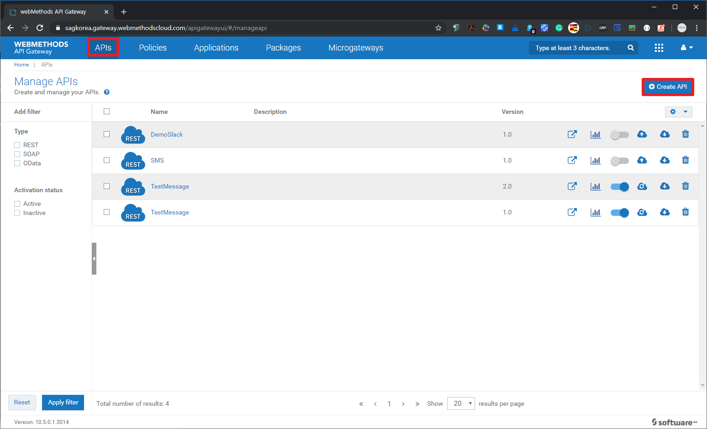
  
  
  
  
  
  
  
  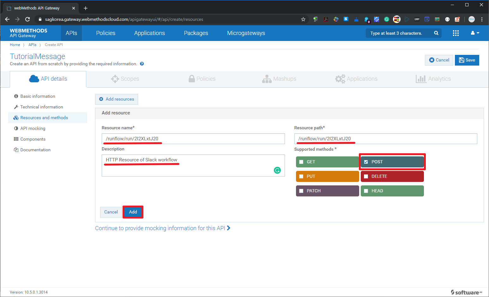
  
  
  
  
  
  
  
  
  
  
  
  
  
  
  
  ## Part 2.2 가독성 높은 HTTP Resource 추가  
  webMethods.io Integration의 Webhook URL은 가독성이 떨어지기 때문에 /slacke/message 와 /sms/message 리소스 추가하여 request path를 매핑해 보도록 하겠습니다.  
  
  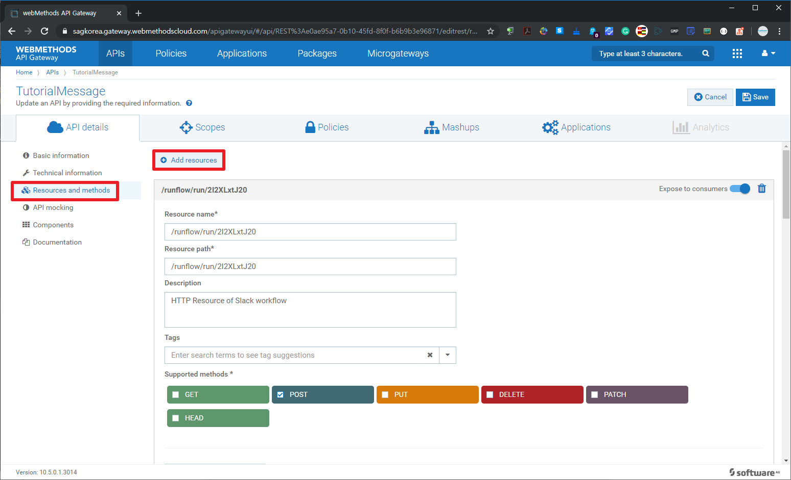
  
  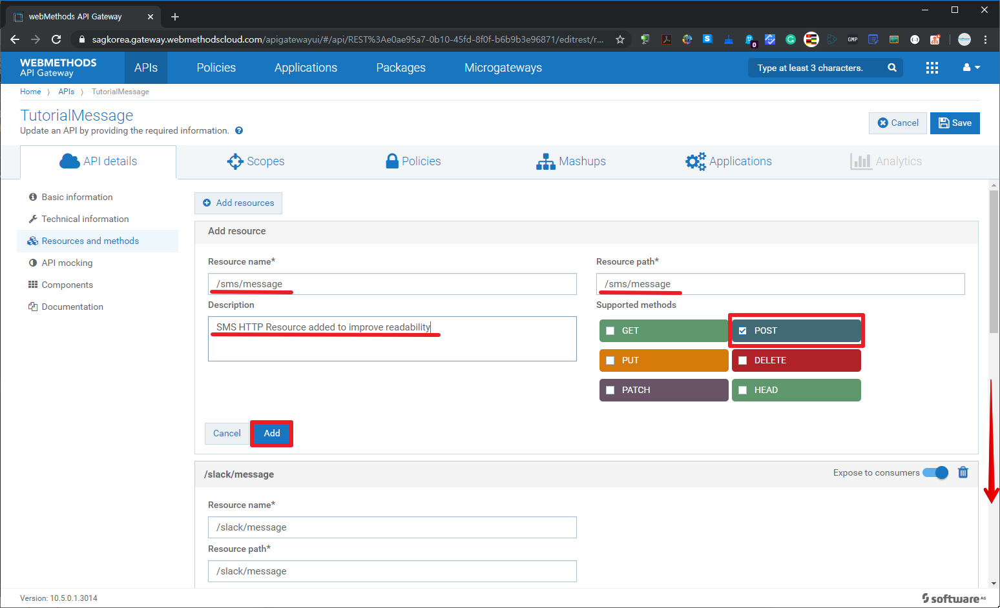
  
  
  
  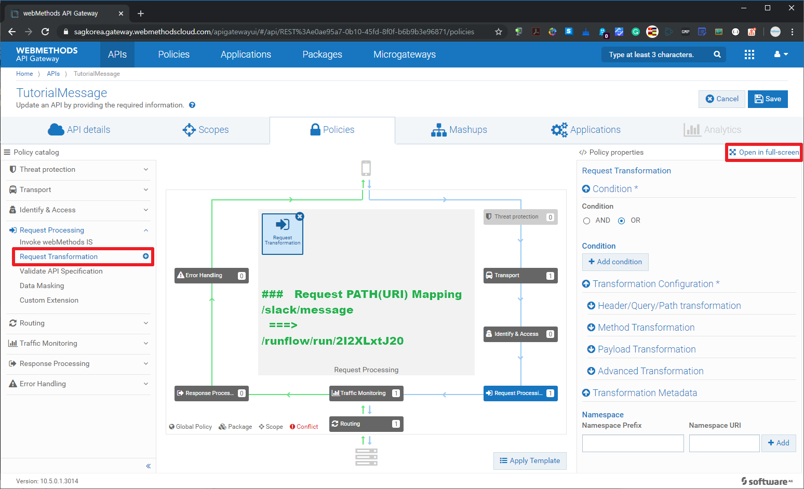
  
  
  
  
  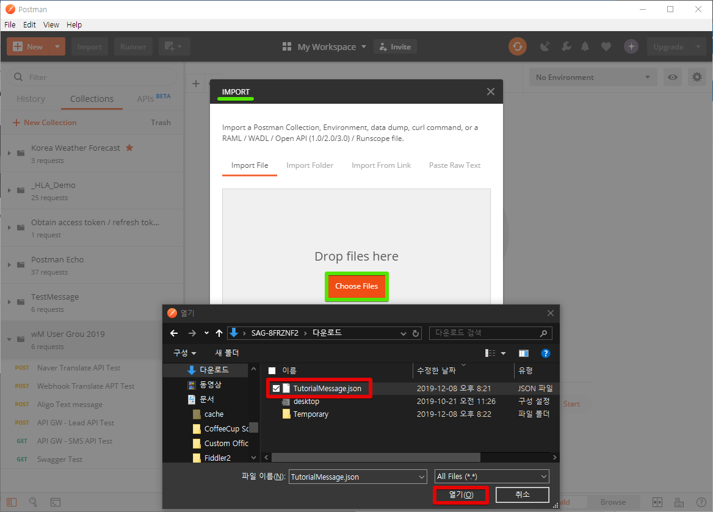
  
  
  
  
  ## Part 2.3 패키지와 플랜 작성  
  지금 만든 API를 배포하여 사용할 수 있지만 보안적인 부분과 API Consumer들에게 API 정책을 차별화하여 제공하기 위해서는 API를 패키징하여 플랜을 같이 제공해야 합니다.  
  Package와 Plan을 작성해보도록 하겠습니다.
  
  
  
  
  
  
  
  
  
  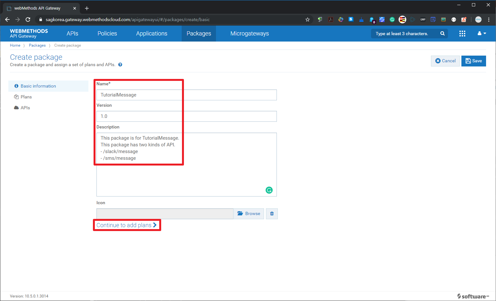
  
  
  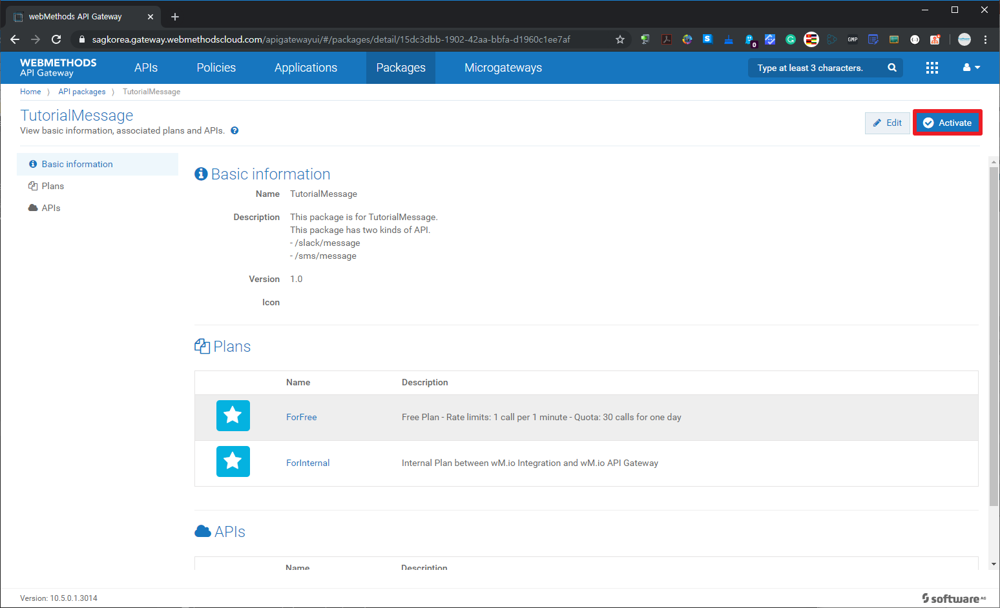
  
  
  
  
  
  
  
  
  
  
  
  
  
  
  ## Part 2.4 API 포탈의 개발자 피드백 확인  
  자연스러운 튜토리얼 진행 흐름은 TutorialMessage API 버전 1.0을 사용하기 위해서 사용하고자 하는 플랜에 가입(Subscription)하고 API Client 개발을 위해서 API Portal에서 선호하는 언어(java,c,c#,node.js 등)의 클라이언트 SDK를 다운로드 받아서 API Client 샘플 코드로 연계해 봐야 합니다.  
  이 부분은 본 튜토리얼에서는 SKIP하고 충분히 사용하다가 API를 사용하다가 불편한 점을 API Portal에 HTTP Resource를 추가 지원해주는 의견을 게시하는 것으로 가정하겠습니다.
  
  
  
  
  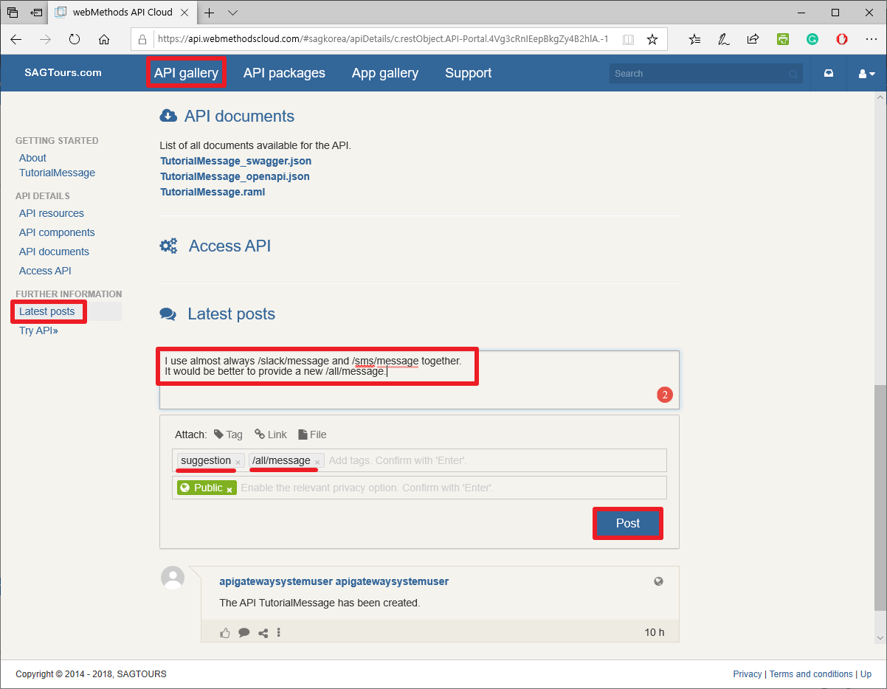
  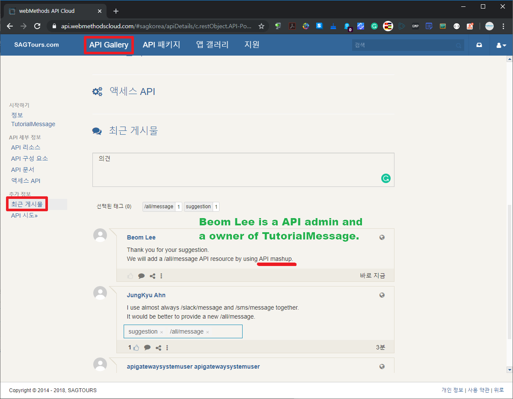
  
  
  ## Part 2.5 Mashup을 이용한 신규 HTTP Resource 생성  
  API Portal의 개선 요청 게시글의 "좋아요" 건수 매우 많아서 개선 요청 내용을 API에 반영해주기로 합니다.  
  API Mashup 기능을 사용하여 쉽게 새로운 HTTP Resource을 추가해보도록 하겠습니다.  
  
  
  
  
  
  
  
  
  
  
  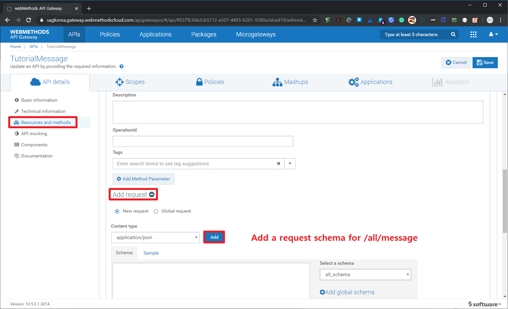
  
  
  
  
  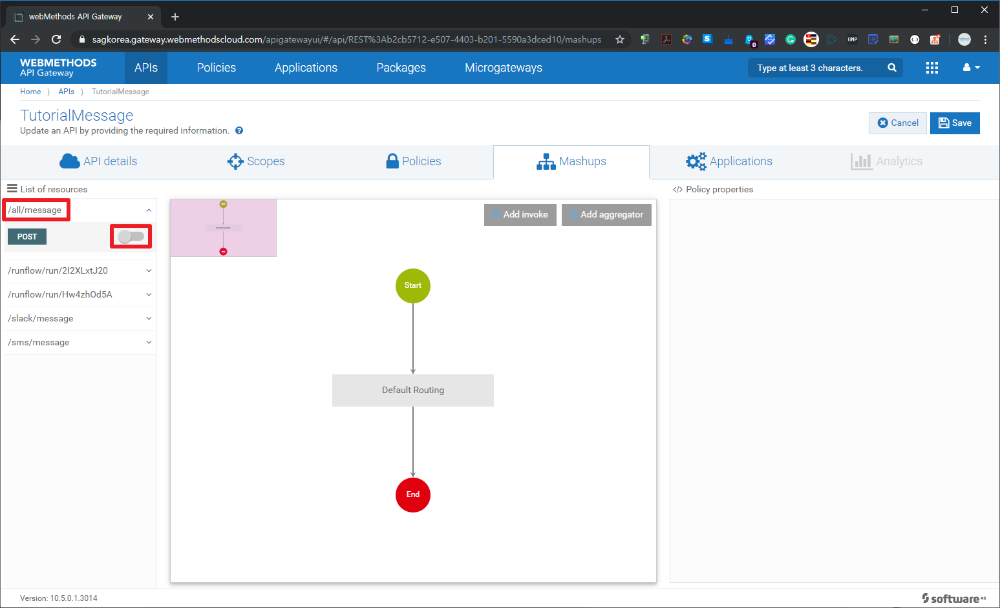
  
  
  
  
  
  
  
  
  
  
  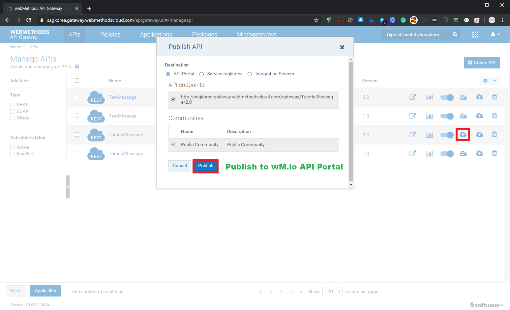
  
  
  
  
  
  
  
  
  
  
  
  
  
  
  
  
  
  
  
  
  
  
