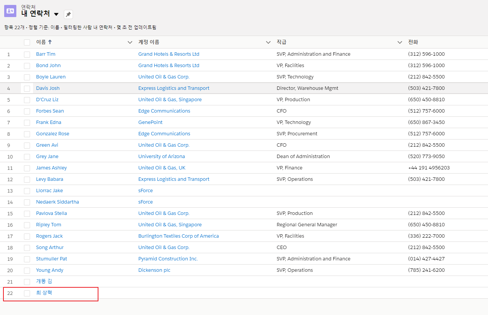

  ## 'CloudStream for Salesforce' 튜토리얼 
  2019년 12월 webMethods User Group Meetup 행사의 클라우드 서비스(SaaS/PaaS)를 연계할 수 있는 CloudStream server에 대한 데모에 대한 튜토리얼입니다.  
  본 튜토리얼에서는 On-premise에 구성된 webMethods Integration에서 Salesforce의 연락처를 inbound/outbound의 양방향 연계하는 방법에 대해서 소개합니다.  
  
  > Main   Author: Software AG 파트너 쿠도 [최상혁](mailto:shyuki1203@cudo.co.kr)  
  > Second Author: Software AG Korea [이범](https://github.com/billybeom)  
  > Last Modified: 19-FEB-2020  
  
  
  ### CloudStream 설치
  CloudStream server 사용을 위하여 webMethods Integration을 설치 시에 아래의 component를 설치하여야 합니다.  
  
  
  설치가 정상적으로 진행되면 아래와 같이 WmCloudStreams 패키지를 확인 할 수 있습니다.  
  
  
  ### Saleforce Connector 설치
  CloudStream server에서 SaaS/PaaS 시스템에 연계하기 위해서는 CloudStream server에 연계하고자 하는 SaaS/PaaS별 Connector를 다운로드 받아서 설치해야 합니다. Software AG에서 지원하고 있는 SaaS/PaaS별 Connector들은 아래의 주소에서 확인할 수 있습니다.  
  http://techcommunity.softwareag.com/ecosystem/communities/public/webmethods/products/cloudstreams/downloads/connectors-cloudstreams/
  
  
  위의 URL에서 Salesforce.com 연계를 위해 Salesforce Connector를 다운로드 받습니다.  
  
  
  CloudStream server에 Salesforce Connector 설치를 위해서 다운로드받은 파일은 아래의 경로에 복사합니다.  
  <SAG_Home>\IntegrationServer\instances\<Instance_name>\replicate\inbound
  
  
  webMethods Integration에 EAI/ESB 어플리케이션(Interface package)를 배포하는 것과 같은 방식으로 아래의 Install Release 버튼을 눌러 설치합니다.  
  
  
  ### Salesforce.com connection 설정
  webMethods Integration의 Admin 화면에서 solution 링크를 선택해서 CloudStream server 설정 화면으로 이동합니다.  
  
  
  
  
  
  설정은 아래와 같은 구조로 진행되면 Pacakge 및 폴더는 사전에 Designer를 이용하여 생성해 두셔야 합니다. (JDBC Connection 구조와 동일)  
  
  
  Connection Type을 Credentials 방법과 OAuth2 방법 모두 지원하고 있습니다.  
  본 튜토리얼에서는 Connection Type을 Credentials 방법으로 진행됩니다.  
  User는 Salesforce의 계정으로 설정하며, Password는 Salesforce에 로그인하는 password와 security token로 설정해야 합니다.  
  Security token은 salesforce.com에 로그인 후 아래와 같이 진행하면 등록된 메일로 받을 수 있습니다. (브라우저의 언어 및 Saleforce 설정에 따라서 메뉴가 다를 수 있습니다.)  
  
  
  
  
  Salesforce 로그인 정보 입력 후, 정상적으로 연결되면 아래 화면과 같이 설정한 Connection이 등록하고 Enabled 링크를 눌러서 활성화할 수 있습니다.  
  
  
  지금까지 CloudStreams server 설치/구성하고 CloudStreams server에 Saleforce Connector 설치/구성 단계가 완료했고 이제 outbound 연계와 inbound 연계를 진행할 수 있습니다.  
   - outbound 연계 정의: CloudStream  --->  SaaS 서비스
   - inbound  연계 정의: CloudStream  <---  SaaS 서비스
  
  
  ### Cloud Connector Service (Outbound Service)
  지금 단계부터는 On-premise에 있는 webMethods Integration의 CloudStreams를 통해서 Salesforce에 연락처를 생성하는 outbound 연계 방법에 대해서 살펴보겠습니다.  
  개발툴인 Designer에서 Cloud Connector Service를 선택하여 CloudStreams Connector를 통해 Wizard 방식으로 SaaS/PaaS의 API를 호출하는 모듈/어플리케이션을 쉽게 개발할 수 있습니다.  
  Designer에서 아래와 같은 Cloud Connector Service 메뉴를 확인할 수 있습니다. 만약 해당 메뉴가 보이지 않는다면 개발툴인 Designer에 CloudStreams Development를 설치해야 합니다.  
  
  
  
  
  Salesforce.com connection 설정 단계에서 구성한 Connection 이름을 선택합니다.  
  
  
  생성 단계를 완료하면 아래와 같이 Salesforce 제공하는 서비스 목록(Operation과 Business Object)을 확인할 수 있는 화면이 나옵니다.  
  
  
  Operation 부분에 연필(edit) 버튼을 선택하여 'create' Operation 선택하고 '연락처' Business Object 선택하여 연락처 등록 서비스에 대한 구성을 합니다.  
  
  
  
  
  
  지금까지 Wizard 방식으로 설정한 내용은 Salesforce에 연락처를 생성하기 위한 구성 단계입니다.  
  기존 webMethods Integration에서 개발하는 것과 같이 서비스를 사용하여 아래와 같이 Wizard 방식으로 편리하고 쉽게 매핑하여 구성할 수 있습니다.  
  
  
  Salesforce에 연락처가 등록되었는지 확인하기 위해서 salesforce.com에 접속하여 연락처 페이지에서 확인합니다.  
  
  
  
  
  
  ### Connector Listener (inbound Service)
  지금부터는 Salesforce에서 연락처가 생성되면 On-premise의 webMethods Integration에 생성된 연락처 정보를 전달하여 연계하는 inbound 튜토리얼입니다.  
  
  Salesforce에서 발생하는 데이터를 받기 위해서는 사전에 Salesforce에서 Topic을 생성해 두어야 하고 Designer에서 Cloud Listener를 구성해야 합니다.  
  Salesforce Developer Console에서 Topic을 먼저 생성합니다.
  
  
  
  pushTopic.Query에 설정한 Query 결과가 이벤트 발생 시 전달될 데이터입니다. 본 튜토리얼에서는 ID와 FirstName 데이터를 가져오도록 query 설정을 하였습니다.
  
  
  Salesforce에서 제공하고 있는 Object 내용은 아래 URL을 참고 하시기 바랍니다.  
  https://developer.salesforce.com/docs/atlas.en-us.object_reference.meta/object_reference/sforce_api_objects_list.htm
  
  Salesforce에서 생성한 Topic에 Listener을 설정하면 Salesforce에 설정한 이벤트 정보를 수신할 수 있습니다.  
  
  
  
  
  
  
  
  Parameters 설정 화면에서 Salesforce에서 생성한 Topic Name인 'TestContract3'로 설정합니다.  
  
  
  Event 설정 화면에서 webMethods Notification 설정하는 것 같이 Event를 받아서 수행할 Flow Service를 연결 합니다.  
  
  
  Salesforce로부터 들어오는 Event 데이터의 구조는 아래와 같으며, type 필드에는 CREATED, DELETED 와 같은 Operation 정보가 들어가며 subject 필드에는 select 문에서 정의한 컬럼의 데이터가 들어갑니다.  
  
  
  아래와 같이 로그를 확인하는 화면에서 Salesforce로부터 연락처 Event를 받은 내역을 확인할 수 있습니다.  
  
  
  
