  ## 'webMethods.io Integration과 API 살펴보기' 튜토리얼 - Part 2  
  
  2019년 12월 webMethods User Group Meetup 행사의 'webMethods.io Integration과 API 살펴보기' Part 2로 webMethods.io API에 대한 튜토리얼입니다.  
  Part 1과 이어지는 튜토리얼이므로 Part 1을 먼저 확인하시고 Part 2를 진행하시기 바랍니다.  
  ['webMethods.io Integration과 API 살펴보기' Part 1](https://github.com/SoftwareAG-Korea/tutorials/blob/master/wmio/integration/salesforce+messanger+sms/README.md)을 참고 하세요.  
  
  Part 1과 Part 2에 대한 전체적인 개요 설명부터 시작하시려면 [Dec-2019 유저 그룹 행사 페이지](https://github.com/SoftwareAG-Korea/tutorials/blob/master/UserGroup/Dec-2019/wmio+integration+api/)를 참고하세요.  
  
  > Author: [Software AG, Korea](https://www.softwareag.com/kr/) [이범](https://github.com/billybeom)  
  > Last Modified: 10-JAN-2020  
  
  
  ### Part 2의 사전 준비 사항  
  * (필수) [webMethods.io API - Free Trial 신청](https://github.com/SoftwareAG-Korea/tutorials/blob/master/UserGroup/Dec-2019/wmio+integration+api/Prerequisite/README.preq1.md)  
  * (옵션) [네이버 파파고 번역 API 사용 신청](https://github.com/SoftwareAG-Korea/tutorials/blob/master/UserGroup/Dec-2019/wmio+integration+api/Prerequisite/README.preq5.md)  

  
  ### Part 2. webMethods.io API 튜토리얼  
  
  webMethods.io Integration에서 만든 Slack과 SMS workflow을 webMethods.io API에서 API로 만들어 봅니다.  
  Part 2 튜토리얼에서 살펴보는 'workflow을 API로 만드는 과정'이 매우 쉽게 바뀔 예정입니다. 2020년 Spring Release에서는 webMethods.io Integration에서 생성한 workflow를 버튼 몇번 클릭으로만으로 webMethods.io API Gateway에 API을 쉽게 배포할 수 있도록 변경 예정입니다.  
  
  ### Part 2.1 webMethods.io API로 이동 및 API 생성  
  webMethods.io에서 API 생성을 위해서 webMethods.io API Gateway로 이동합니다.   
  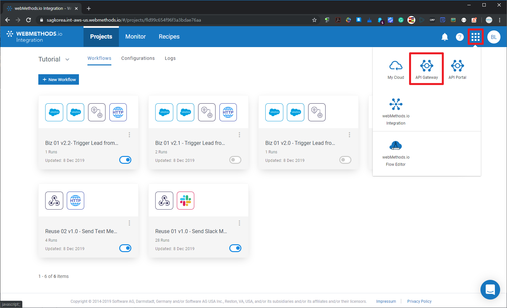  
  APIs 메뉴를 선택한 후 'Create API' 버튼을 클릭하여 API 생성을 시작합니다.  
    
  OpenAPI 3.0, Swagger 2.0, RAML 등의 API 명세서(Specification)의 파일이나 URL을 통해서 APIs을 쉽게 생성할 수 있습니다.  
  본 Part 2 튜토리얼은 webMethods.is Integration에서 생성한 workflow에 Webhook으로 생성된 URL을 매뉴얼하게 API를 생성하는 과정으로 진행되기 때문에 3번째 scratch 방식을 선택합니다.  
    
  
  아래의 URL은 webMethods.io Integration에서 생성했단 Slack과 SMS 메시지를 보내는 workflow의 Webhook URL과 파라미터입니다.  
  API로 등록할 Native 서비스(Slack과 SMS workflow)의 Server URL과 HTTP Resource를 확인합니다. Slack/SMS을 보내는 Workflow에 대한 API를 각각 만들지 않고 TutorialMessage 라는 API 서비스로 만들어서 2개의 Native 서비스를 가지고 있도록 API를 아래처럼 구성합니다.  
    
  Slack과 SMS workflow에 대한 API에 대한 기본 정보인 Tags, Description 등을 입력합니다.  
    
  자신의 테넌트 이름으로 생성된 webMethods.io Integration의 Server URL을 입력하여 추가합니다.  
    
    
  'Add resources'을 클릭하여 TutorialMessage에서 제공할 HTTP Resource들을 추가합니다.  
    
  아래 2개의 그림은 Slack 메시지를 보내는 Slack workflow에 대한 Native 서비스의 URI(HTTP Resource)를 추가하는 과정입니다.  
    
    
  아래 2개의 그림은 SMS 메시지를 보내는 SMS workflow에 대한 Native 서비스의 URI(HTTP Resource)를 추가하는 과정입니다.  
    
  API에 대한 필수 정보 설정이 끝났으니 저장합니다.  
    
  (옵션) 다음은 필수 과정이 아니지만 Schema validation과 Sample을 입력하는 과정입니다. 이와 같은 정보를 설정하면 API 명세서(Specification)에 보다 많은 정보가 담기게 되어 API 개발자들이 보다 API를 쉽게 연동하는데 도움을 수 있습니다.  
    
    
    
  API에 등록될 HTTP Resource들에 대한 스키마 등록 단계입니다. 스키마를 등록해두면 API Gateway가 API 호출 요청이 받았을 때 Schema validation하는 기능을 이용할 수 있습니다.  
  아래 과정은 Slack에 대한 스키마를 등록하는 과정입니다.  
    
  JSON 샘플을 입력하면 JSON Schema를 생성해주는 서비스를 이용하여 Slack에 대한 Schema를 생성합니다. 필요에 따라서 자동 생성된 Schema를 수정해서 사용합니다.  
  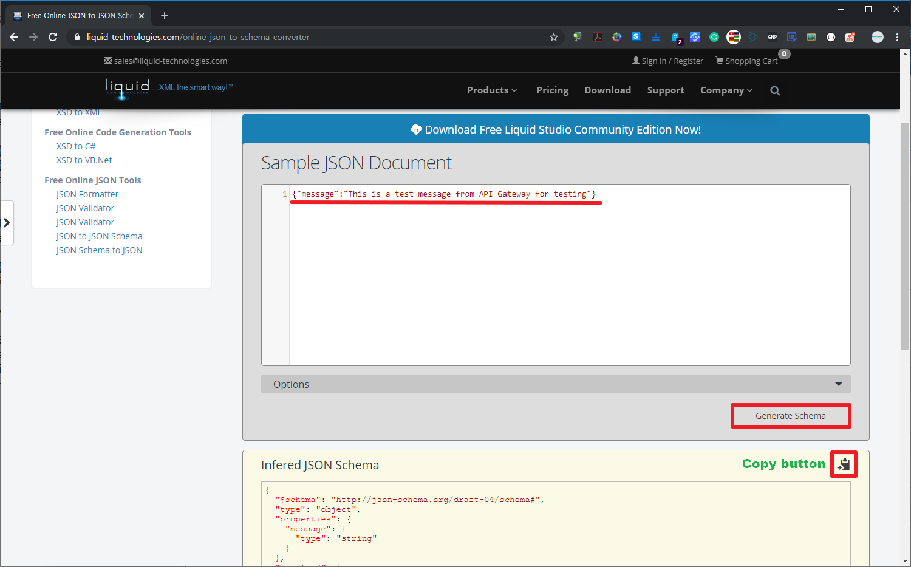  
  Slack에 대한 JSON Schema를 설정합니다.  
    
  아래 과정은 SMS에 대한 스키마를 등록하는 과정입니다.  
  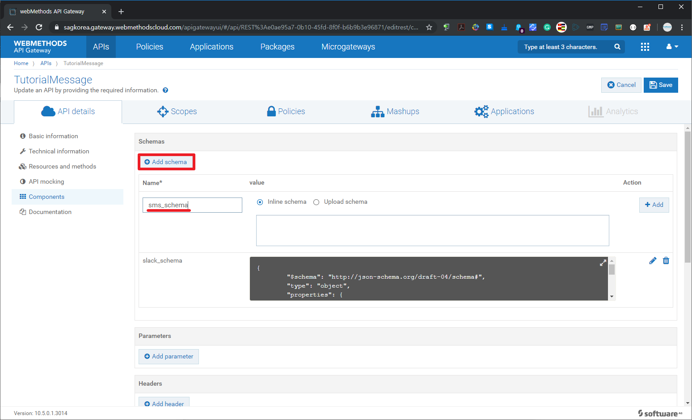  
  위에서 Slack에 대한 스키마를 자동 생성한 것과 같이 SMS에 대한 Schema를 생성합니다. 필요에 따라서 자동 생성된 Schema를 수정해서 사용합니다.  
    
  SMS에 대한 JSON Schema를 설정합니다.  
    
  아래 과정은 샘플을 입력하는 과정입니다. Slack과 SMS에 대한 JSON Schema를 생성할 사용했던 샘플 JSON으로 설정합니다.  
    
    
    
  
  
  ### Part 2.2 가독성 높은 HTTP Resource 추가  
  webMethods.io Integration의 Webhook URL은 가독성이 떨어지기 때문에 /slacke/message 와 /sms/message 리소스 추가하여 request path를 매핑해 보도록 하겠습니다.  
  
  
  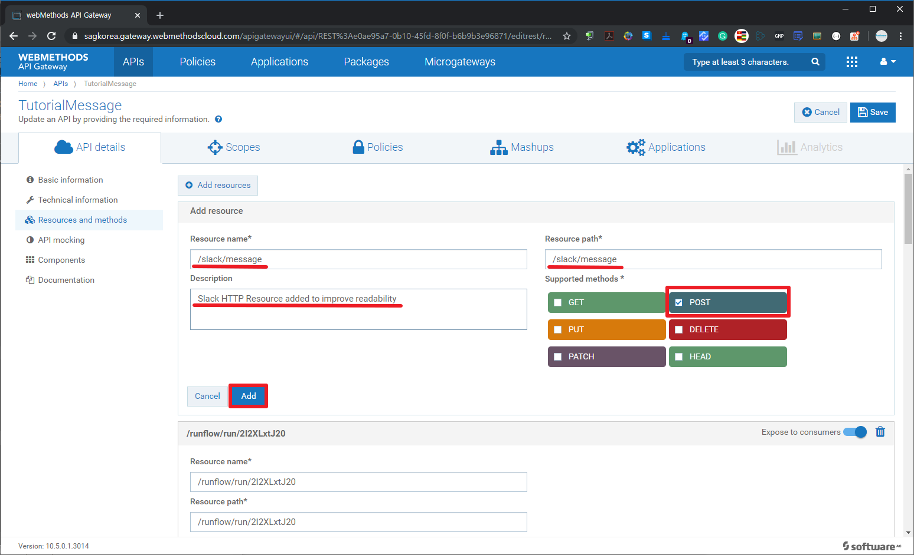
  
  
  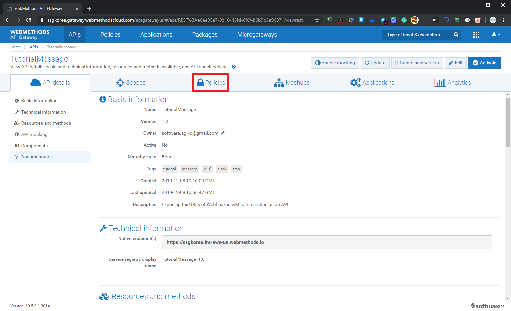
  
  
  
  
  
  
  
  
  
  
  
  ### Part 2.3 패키지와 플랜 작성  
  지금 만든 API를 배포하여 사용할 수 있지만 보안(Security)적인 부분과 API Consumer들에게 API 정책을 차별화하여 제공하기 위해서는 API를 패키징하여 플랜을 같이 제공해야 합니다.  
  Package와 Plan을 작성해보도록 하겠습니다.
  
  
  
  
  
  
  
  
  
  
  
  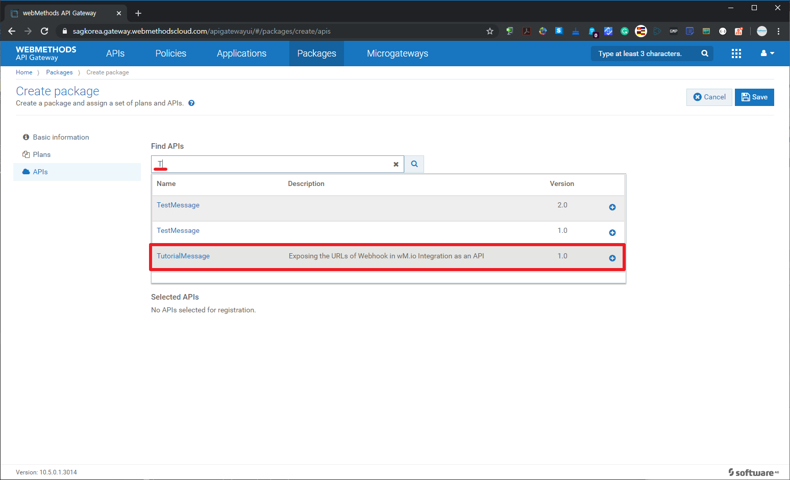
  
  
  
  
  
  
  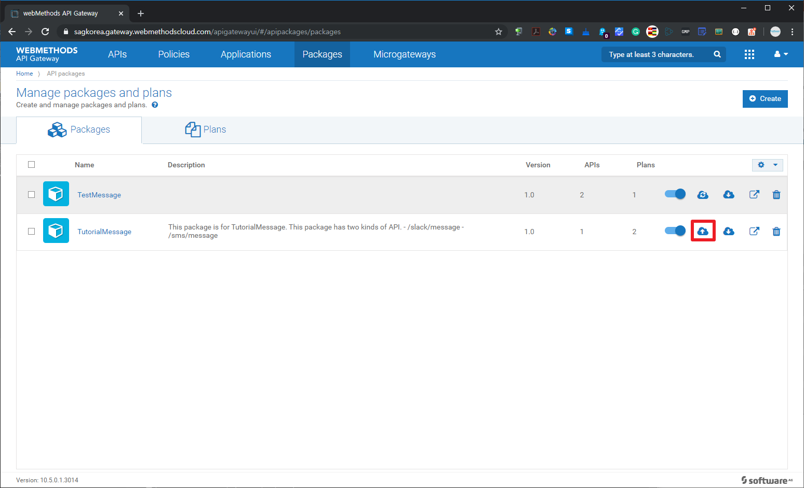
  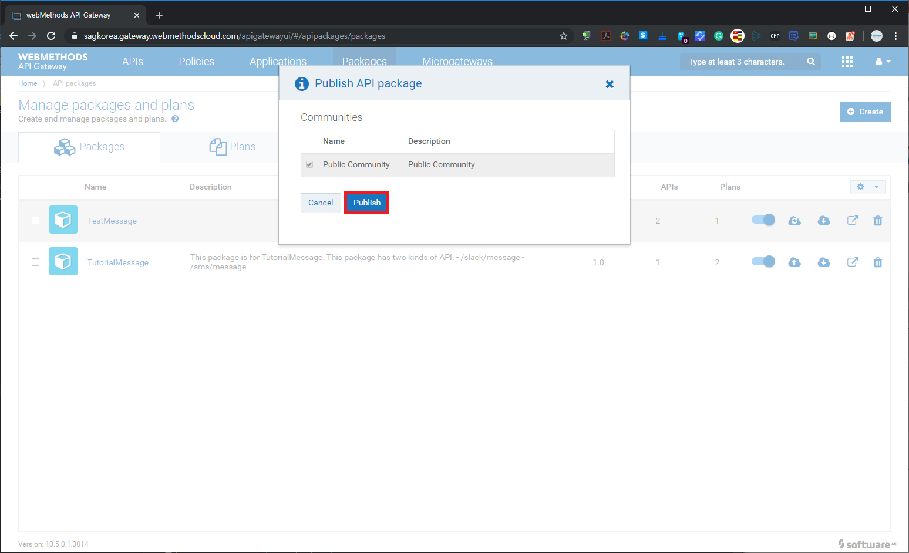
  
  
  
  
  
  
  
  ### Part 2.4 API 포탈의 개발자 피드백 확인  
  자연스러운 튜토리얼 진행 흐름은 TutorialMessage API 버전 1.0을 사용하기 위해서 사용하고자 하는 플랜에 가입(Subscription)하고 API Client 개발을 위해서 API Portal에서 선호하는 언어(java,c,c#,node.js 등)의 클라이언트 SDK를 다운로드 받아서 API Client 샘플 코드로 연계해 봐야 합니다.  
  본 튜토리얼에서는 TutorialMessage API 버전 1.0을 어느 정도 기간동안 충분히 API를 연동하다가 불편한 점을 API Portal에 새로운 HTTP Resource를 추가 지원해달라고 하는 의견을 게시하는 것으로 가정하겠습니다.
  
  
  
  
  
  
  
  
  ### Part 2.5 Mashup을 이용한 신규 HTTP Resource 생성  
  API Portal의 개선 요청 게시글의 "좋아요" 건수가 높은 것을 확인하고 개선 요청 내용을 API에 반영해주기로 합니다.  
  API의 Natvie 서비스를 추가 개발하는 것이 아니라 API Gateway 단에서 기존의 API Resource들을 가지고 API를 Mashup하여 새로운 HTTP Resource을 쉽게 빠르게 추가해 보도록 하겠습니다.  
  
  
  
  
  
  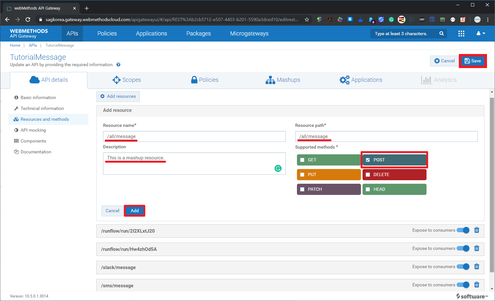
  
  
  
  
  
  
  
  
  
  
  
  
  
  
  
  
  
  
  
  
  
  
  
  
  
  
  
  
  
  
  
  
  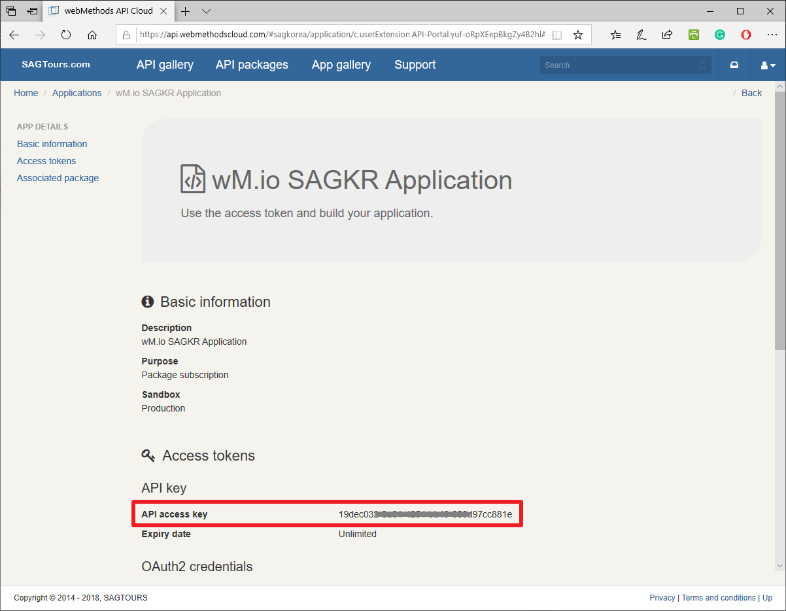
  
  
  
  
  
  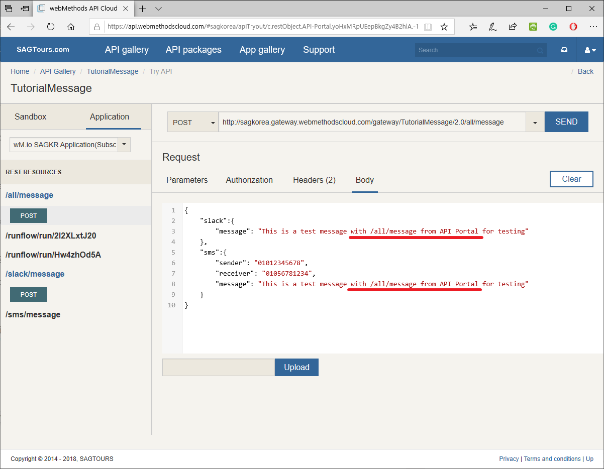
  
  
  
  
  ### [API 해커톤 및 베타 프로그램](https://engage.softwareag.cloud/)  
  살아있는 API 서비스를 하기 위해서는 API 개발자들과 지속적으로 소통할 수 있는 채널이 필요합니다.  
  API Portal의 커뮤너티 등을 이용하여 소통도 당연히 해야 하겠지만 API 개발자들의 보다 적극적인 참여 유도 및 동기 부여를 위해서 해커톤 및 베타 프로그램 행사가 필요하기도 합니다.  
  API Engagement platform 서비스는 webMethods.io와는 별도로 제공하는 클라우드 서비스로 필요한 기간 동안만 API 해커톤/베타 프로그램을 빠르고 쉽게 연결하여 운영할 수 있습니다.  
  API Engagement platform 서비스를 통해서 API Consumer와 API Provider들은 보다 긴밀히 소통할 수 있습니다.  
  API Engagement platform 서비스 URL: https://engage.softwareag.cloud  
  
  
