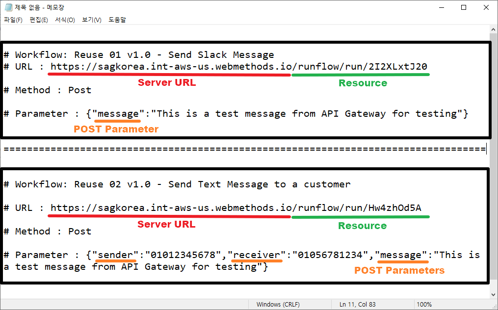
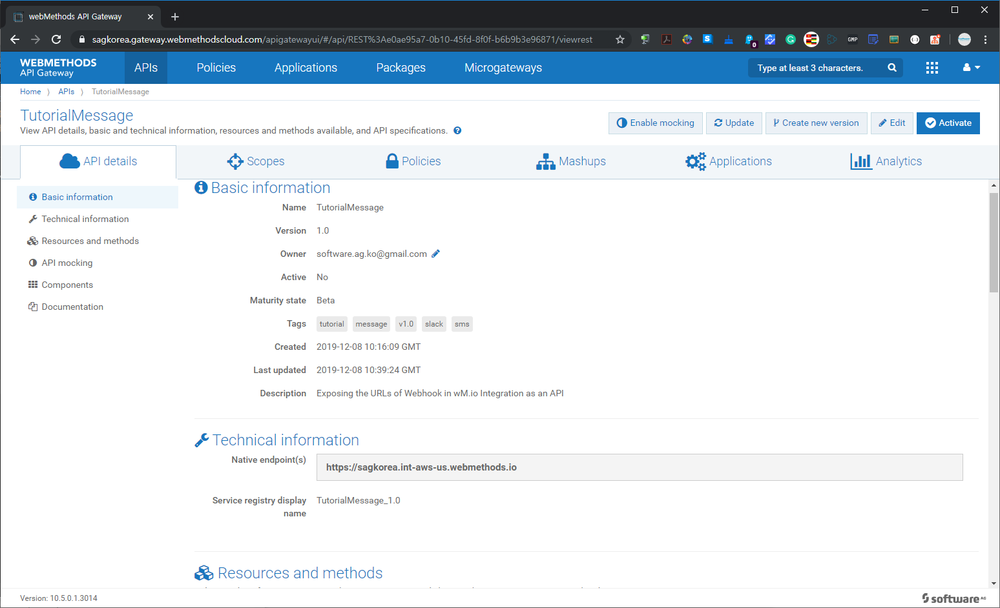
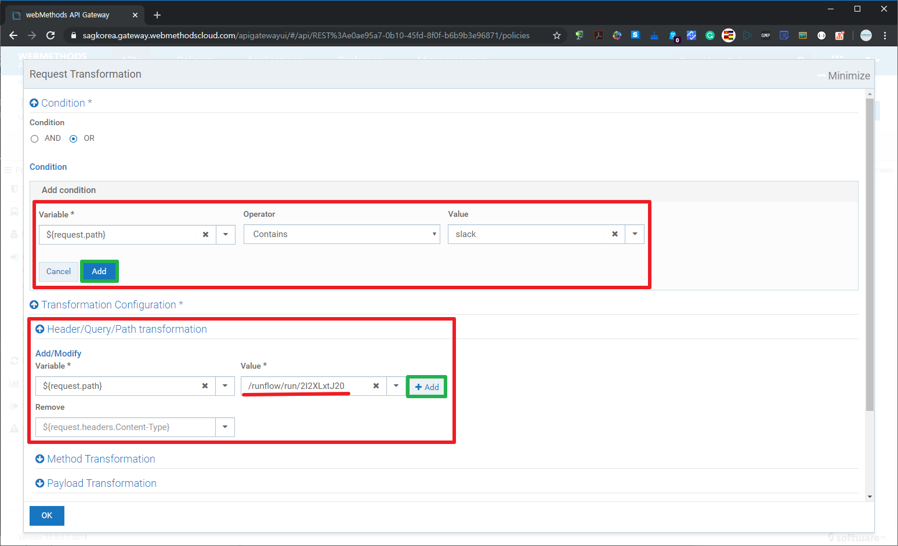
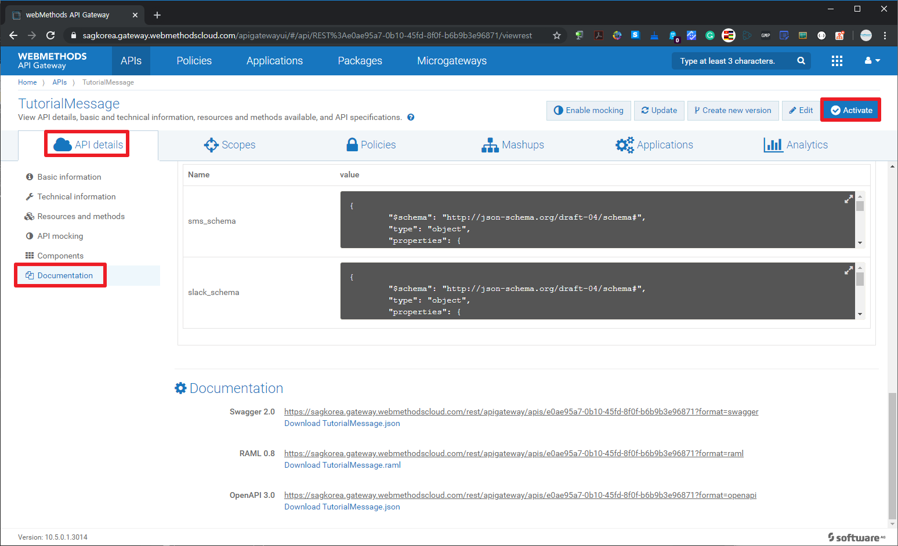
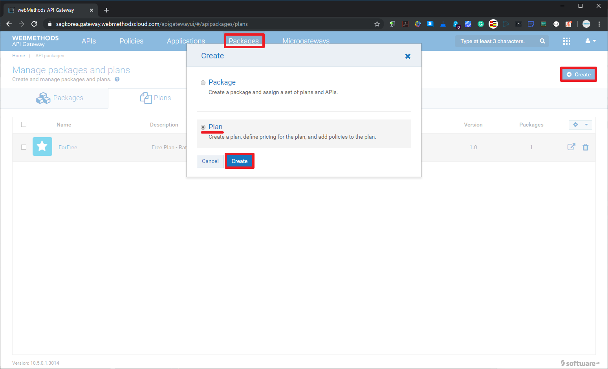
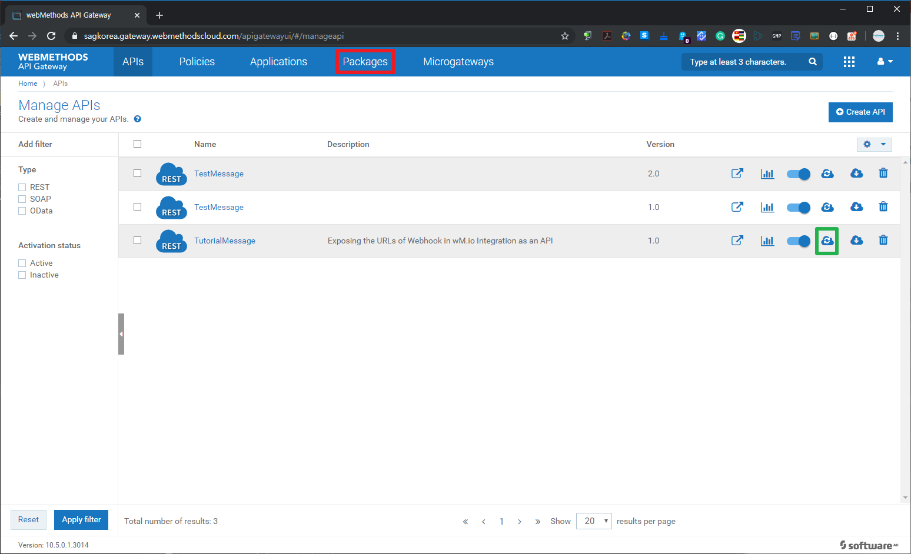
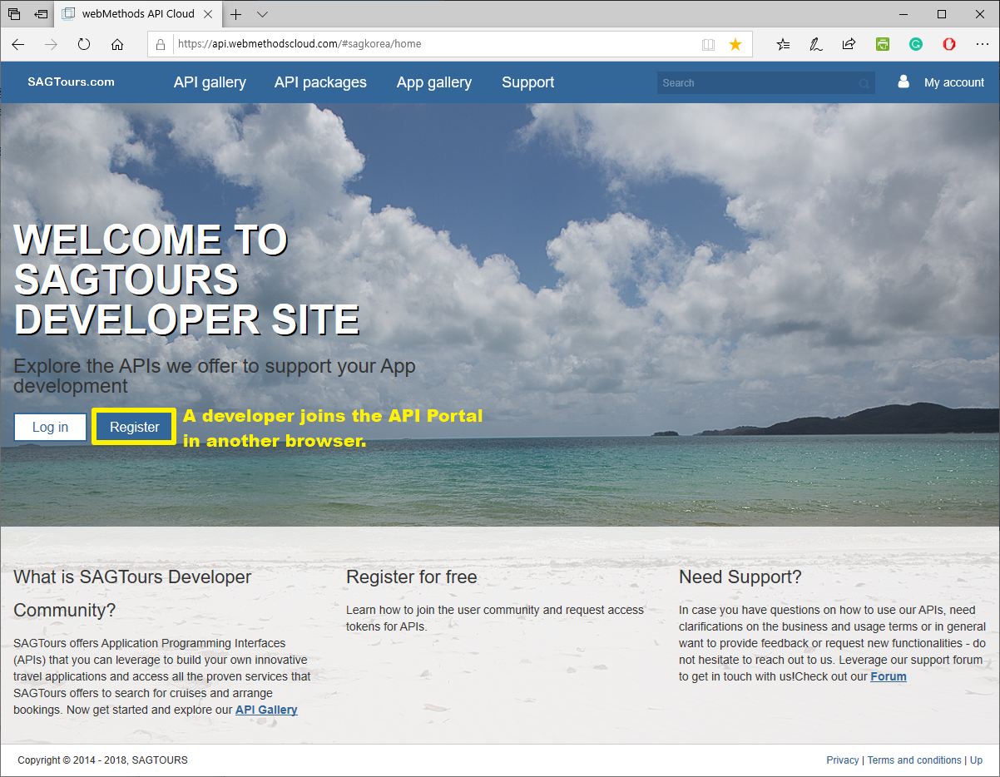
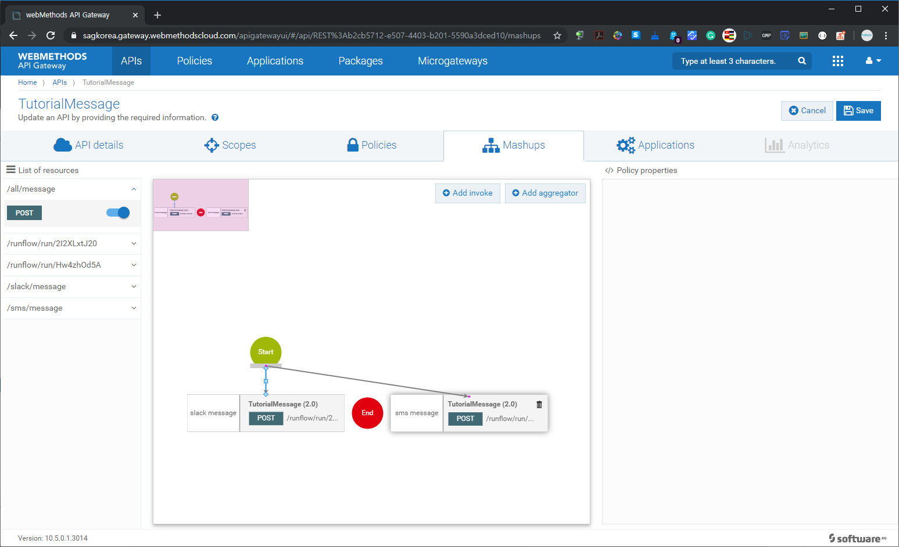

  ## 'webMethods.io Integration과 API 살펴보기' 튜토리얼 - Part 2  
  
  2019년 12월 webMethods User Group Meetup 행사의 'webMethods.io Integration과 API 살펴보기' Part 2로 webMethods.io API에 대한 튜토리얼입니다.  
  Part 1과 이어지는 튜토리얼이므로 Part 1을 먼저 확인하시고 Part 2를 진행하시기 바랍니다.  
  ['webMethods.io Integration과 API 살펴보기' Part 1](https://github.com/SoftwareAG-Korea/tutorials/blob/master/wmio/integration/salesforce+messanger+sms/README.md)을 참고 하세요.  
  
  Part 1과 Part 2에 대한 전체적인 개요 설명부터 시작하시려면 [Dec-2019 유저 그룹 행사 페이지](https://github.com/SoftwareAG-Korea/tutorials/tree/master/UserGroup/Dec-2019/wmio+integration+api/)를 참고하세요.  
  
  > Author: Software AG Korea [이범](https://github.com/billybeom)  
  > Last Modified: 10-JAN-2020  
  
  
  ### Part 2의 사전 준비 사항  
  * (필수) [webMethods.io API - Free Trial 신청](https://github.com/SoftwareAG-Korea/tutorials/blob/master/UserGroup/Dec-2019/Prerequisite/README.preq1.md)  
  * (옵션) [네이버 파파고 번역 API 사용 신청](https://github.com/SoftwareAG-Korea/tutorials/blob/master/UserGroup/Dec-2019/Prerequisite/README.preq5.md)  

  
  ### Part 2. webMethods.io API 튜토리얼  
  
  webMethods.io Integration에서 만든 Slack과 SMS workflow을 webMethods.io API에서 API로 만들어 봅니다.  
  Part 2에서 workflow을 API로 만드는 부분이 매우 쉽게 바뀔 예정입니다. webMethods.io의 2020년 Spring Release에서는 만든 workflow를 버튼 몇번 클릭으로만으로 webMethods.io API Gateway에 API로 쉽게 배포할 수 있습니다.  
  
  ### Part 2.1 webMethods.io API로 이동 및 API 생성  
  
  
    
    
  아래의 URL은 webMethods.io Integration에서 생성한 flow의 webhook URL과 파라미터입니다. API로 등록할 Native 서비스의 Server URL과 HTTP Resource를 확인합니다.
  
  
  
  
  
  
  
  
  
  
    
    
  다음은 스키마 등록 단계입니다. 필수단계는 아니지만 스키마를 등록해두면 API Gateway가 API 호출 요청이 받았을 때 Schema validation하는 기능을 설정할 수 있습니다.  
  
  
  
  
  
  
  
  
  
  
  
  ### Part 2.2 가독성 높은 HTTP Resource 추가  
  webMethods.io Integration의 Webhook URL은 가독성이 떨어지기 때문에 /slacke/message 와 /sms/message 리소스 추가하여 request path를 매핑해 보도록 하겠습니다.  
  
  
  
  
  
  
  
  
  
  
  
  
  
  
  
  
  
  ### Part 2.3 패키지와 플랜 작성  
  지금 만든 API를 배포하여 사용할 수 있지만 보안(Security)적인 부분과 API Consumer들에게 API 정책을 차별화하여 제공하기 위해서는 API를 패키징하여 플랜을 같이 제공해야 합니다.  
  Package와 Plan을 작성해보도록 하겠습니다.
  
  
  
  
  
  
  
  
  
  
  
  
  
  
  
  
  
  
  
  
  
  
  
  
  
  
  
  ### Part 2.4 API 포탈의 개발자 피드백 확인  
  자연스러운 튜토리얼 진행 흐름은 TutorialMessage API 버전 1.0을 사용하기 위해서 사용하고자 하는 플랜에 가입(Subscription)하고 API Client 개발을 위해서 API Portal에서 선호하는 언어(java,c,c#,node.js 등)의 클라이언트 SDK를 다운로드 받아서 API Client 샘플 코드로 연계해 봐야 합니다.  
  본 튜토리얼에서는 TutorialMessage API 버전 1.0을 어느 정도 기간동안 충분히 API를 연동하다가 불편한 점을 API Portal에 새로운 HTTP Resource를 추가 지원해달라고 하는 의견을 게시하는 것으로 가정하겠습니다.
  
  
  
  
  
  
  
  
  ### Part 2.5 Mashup을 이용한 신규 HTTP Resource 생성  
  API Portal의 개선 요청 게시글의 "좋아요" 건수가 높은 것을 확인하고 개선 요청 내용을 API에 반영해주기로 합니다.  
  API의 Natvie 서비스를 추가 개발하는 것이 아니라 API Gateway 단에서 기존의 API Resource들을 가지고 API를 Mashup하여 새로운 HTTP Resource을 쉽게 빠르게 추가해 보도록 하겠습니다.  
  
  
  
  
  
  
  
  
  
  
  
  
  
  
  
  
  
  
  
  
  
  
  
  
  
  
  
  
  
  
  
  
  
  
  
  
  
  
  
  
  
  
  
  
  
  
  
  
  
  ### [API 해커톤 및 베타 프로그램](https://engage.softwareag.cloud/)  
  살아있는 API 서비스를 하기 위해서는 API 개발자들과 지속적으로 소통할 수 있는 채널이 필요합니다.  
  API Portal의 커뮤너티 등을 이용하여 소통도 당연히 해야 하겠지만 API 개발자들의 보다 적극적인 참여 유도 및 동기 부여를 위해서 해커톤 및 베타 프로그램 행사가 필요하기도 합니다.  
  API Engagement platform 서비스는 webMethods.io와는 별도로 제공하는 클라우드 서비스로 필요한 기간 동안만 API 해커톤/베타 프로그램을 빠르고 쉽게 연결하여 운영할 수 있습니다.  
  API Engagement platform 서비스를 통해서 API Consumer와 API Provider들은 보다 긴밀히 소통할 수 있습니다.  
  API Engagement platform 서비스 URL: https://engage.softwareag.cloud  
  
  
