  ## 'webMethods.io B2B' 튜토리얼 
  2019년 12월 webMethods User Group Meetup 행사의 webMethods.io B2B에 대한 튜토리얼입니다.  
  본 튜토리얼에서는 webMethods.io의 B2B SaaS 서비스에 대한 기능과 간단한 사용 방법을 소개합니다.   
  
  > Main   Author: Software AG 파트너 [Northstar(노스스타컨설팅)](http://www.northstar.co.kr/) [이인호](mailto:inhovb@northstar.co.kr)  
  > Second Author: [Software AG, Korea](https://www.softwareag.com/kr/) [이범](https://github.com/billybeom)  
  > Last Modified: 28-FEB-2020  
  
  
  ### Software AG의 B2B Integration 솔루션은 무엇인가?
  Software AG의 B2B 솔루션을 이용하면 고객사와의 전자 문서(EDI:Electronic Data Interchange) 송수신 처리에 대해서 코딩을 최소화한 GUI 방식의 Rule 기반으로 자동화할 수 있으며 B2B를 가시화하여 체계적이고 쉽게 관리할 수 있습니다.  
  
  > #### B2B 통합 솔루션을 통한 사용자의 혜택:
     - 고객사 프로파일 관리
     - 문서와 메시지에 대한 표준화
     - 고객사와의 문서 송수신
     - 다양한 문서 변환에 따른 표준화
     - 고객사의 문서 송수신에 대한 트래킹 및 모니터링 관리  
  
  ### webMethods.io B2B - Integration Platform
  Software AG의 B2B 솔루션을 설명하는 Architecture 소개하고 webMethods.io B2B에서 고객사와의 EDI 송수신을 위한 4가지 단계에 대해서 설명하겠습니다.   
  먼저 Software AG의 B2B 솔루션을 설명하는 Architecture 입니다. 아래의 Architecture에서 표현되어 있는 부분과 같이 표준 B2B 서비스를 위한 파트너관리, 문서관리, 모니터링 등을 지원하고 있습니다.  
  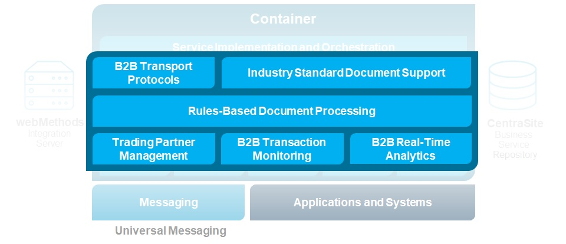  
  
  이제부터 EDI 송수신을 위한 4가지 단계에 대해서 설명하겠습니다. 4가지 단계는 아래와 같습니다.
  * Integrating Trading Partners
  * Document Processing
  * Supporting B2B Standards
  * Monitoring and Analytics

  #### 1. Integrating Trading Partners
  - B2B Service를 위한 파트너 정보와 서비스를 위한 표준 문서 및 서비스 모니터링 관리를 지원합니다.  
  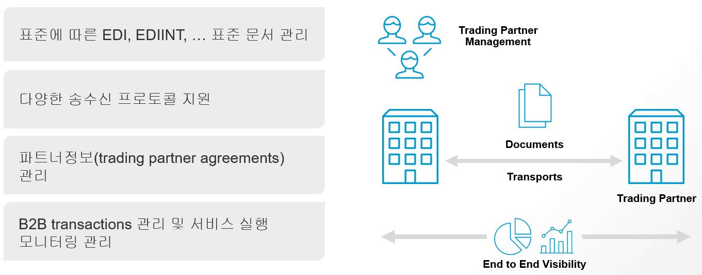  
  - 파트너 정보관리는 아래와 같이 트랜잭션 및 보안에 대한 정보도 포함됩니다.  
  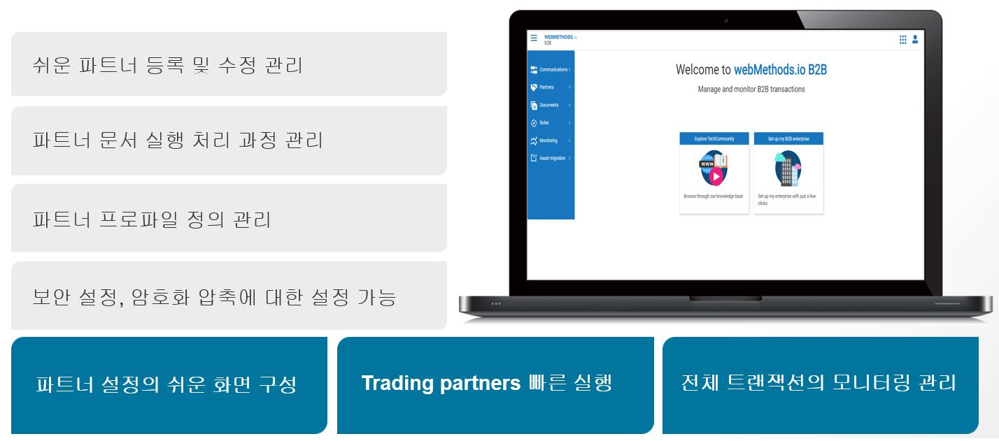  
  - 쉽고 빠른 파트너 설정과 파트너 각각의 송수신 방법에 대하여 쉽고 빠르게 설정할 수 있습니다.  
  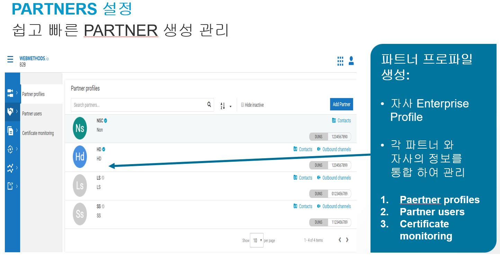  
  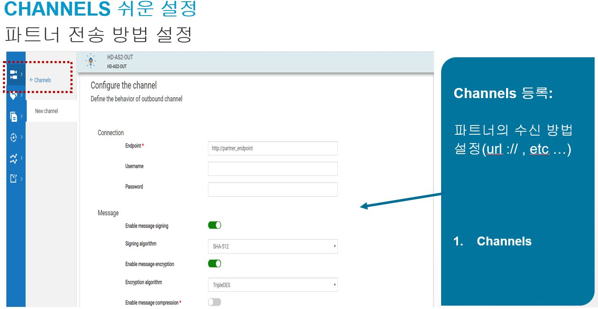  
  - 요약: Integrating Trading Partners  
  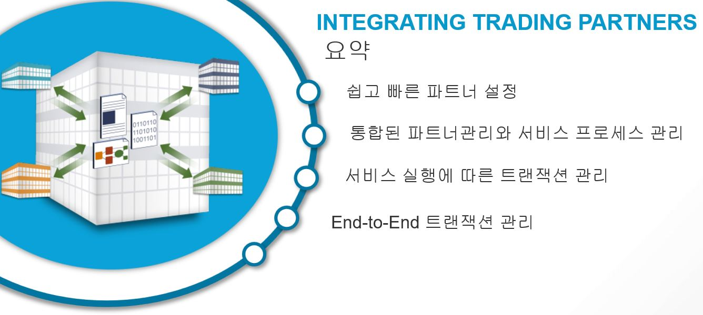  
  
  
  #### 2. Document Processing  
  - 표준 문서 등록과 프로세스 실행에 대한 관리를 지원합니다.  
  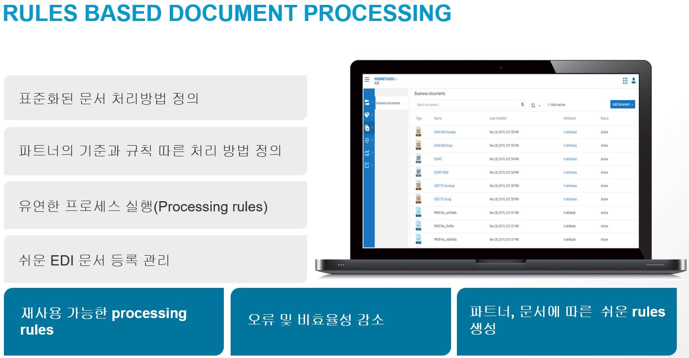  

  - 간단한 선택만으로 EDI 문서를 등록하여 사용 가능합니다.  
  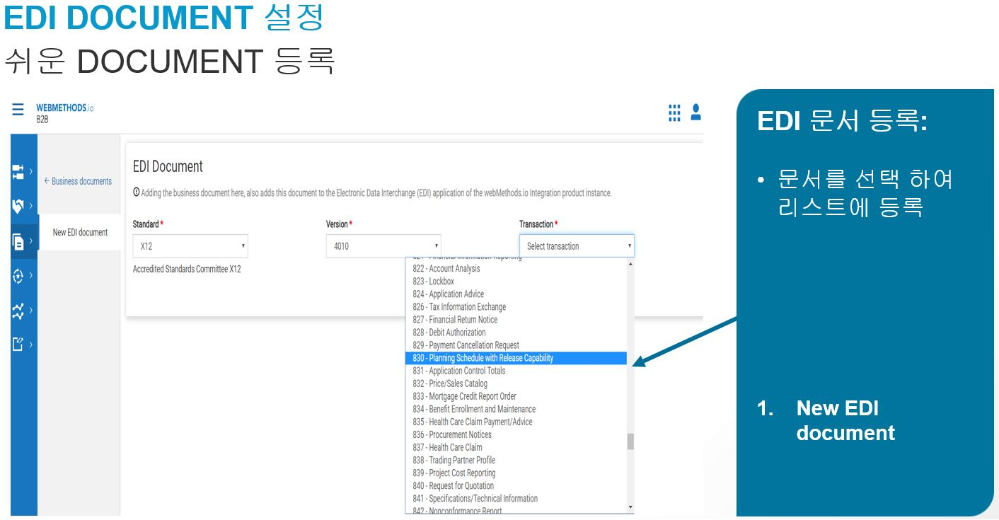  

  - 프로세스 룰을 등록하여 파트너별 또는 프로세스별 설정하여 서비스를 사용 가능합니다.  
  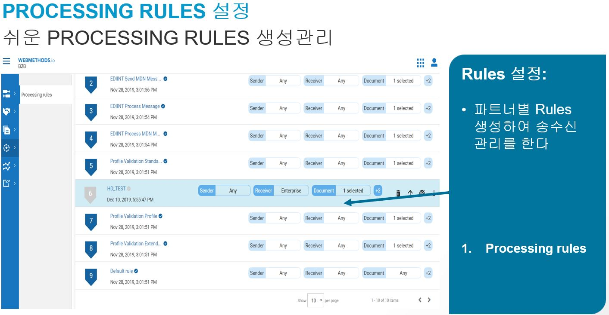  

  - 요약: Document Processing  
  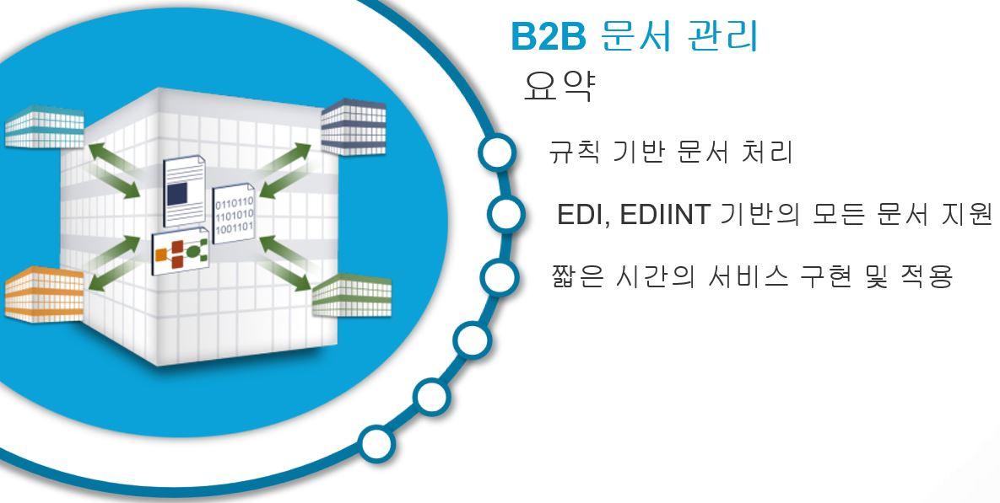  
  
  
  #### 3. Supporting B2B Standards  
  - 모든 B2B 표준과 EDI 표준 문서를 지원합니다.  
  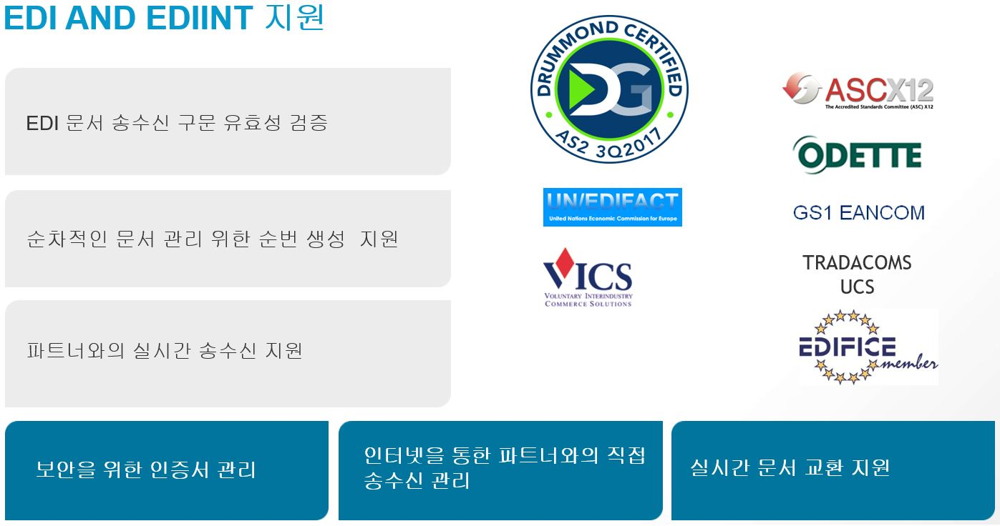  
  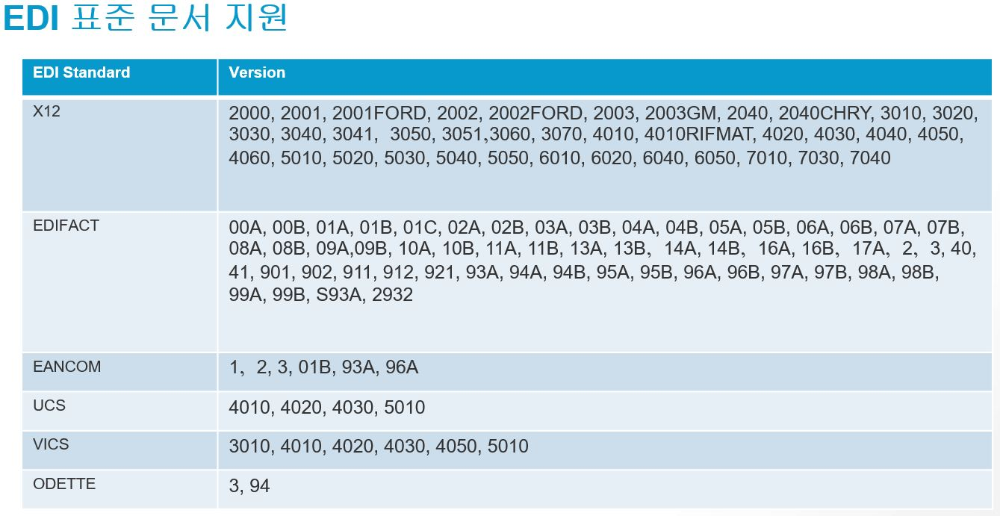  
  - 요약: B2B Standards  
  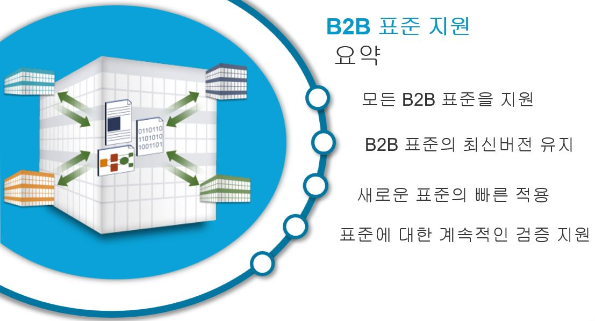  
  
  
  #### 4. Monitoring and Analytics  
  - 서비스 흐름에 대한 모니터링을 지원합니다.  
  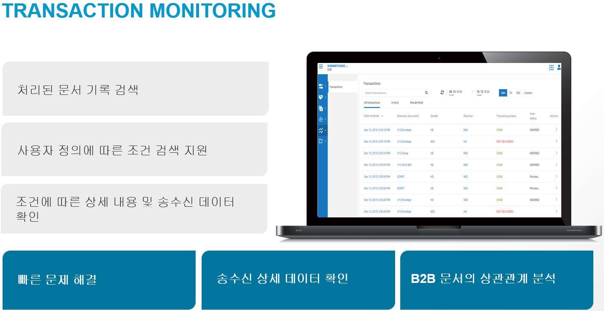  
  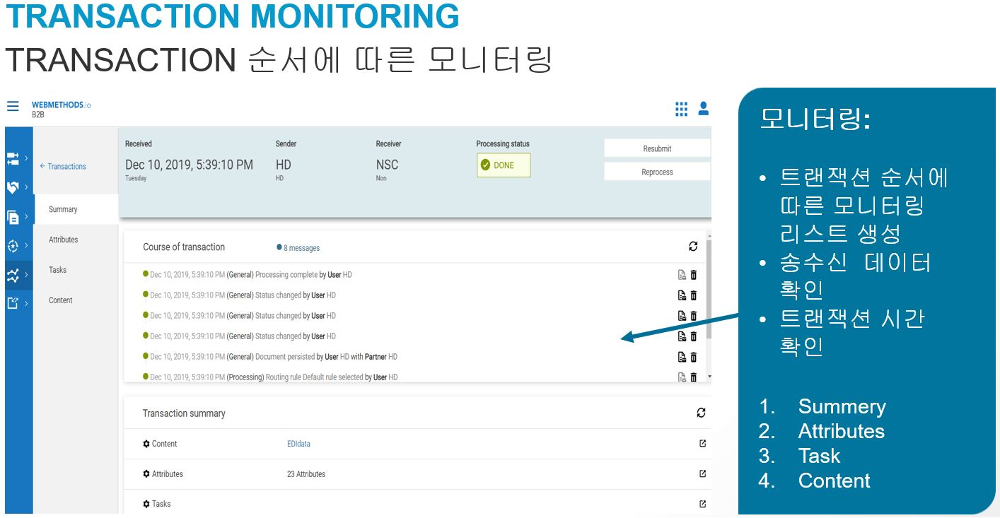  

  - 요약: Monitoring and Analytics  
  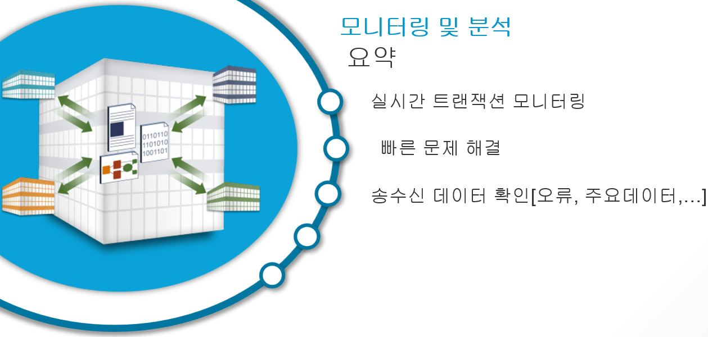  
  
  
