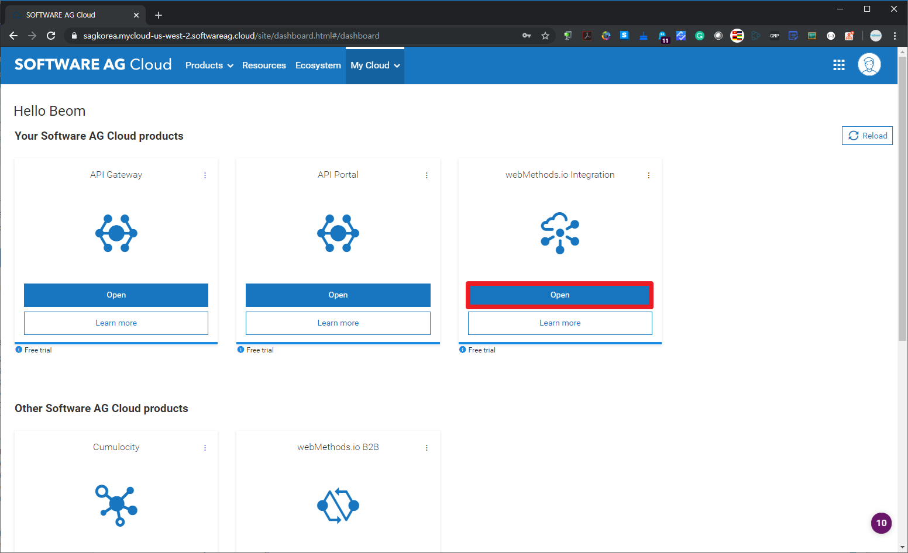
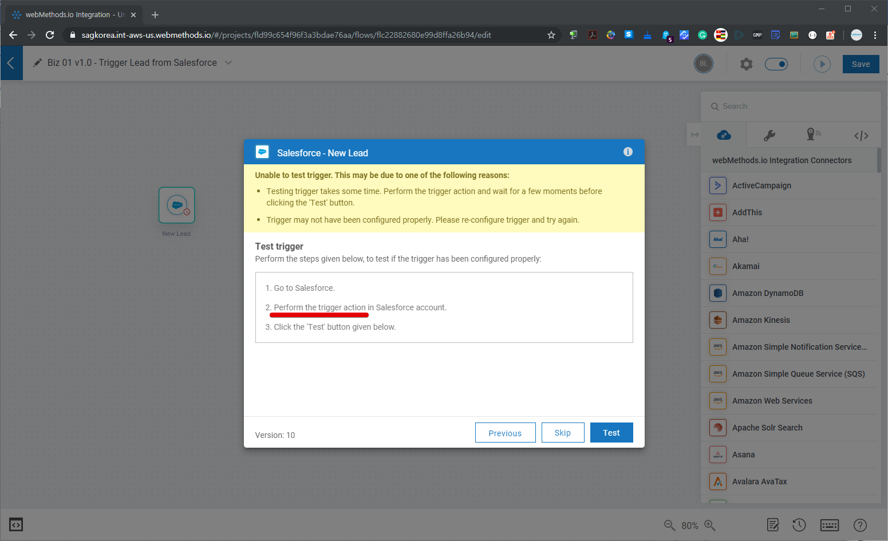
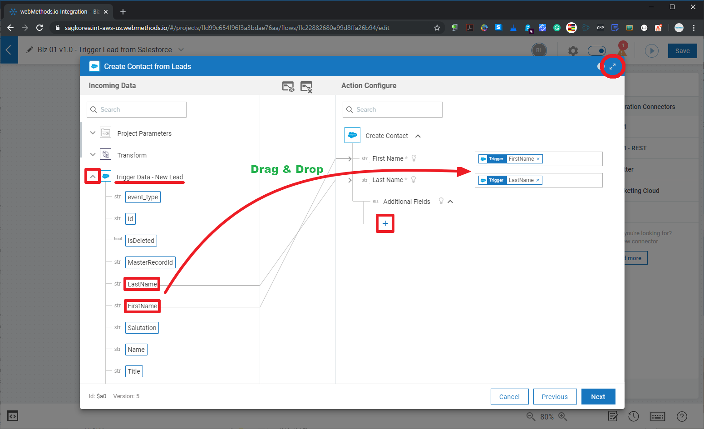
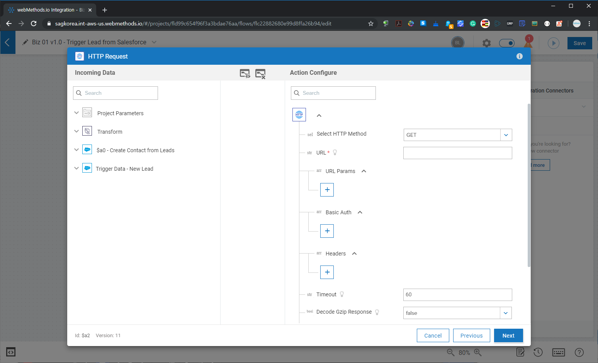
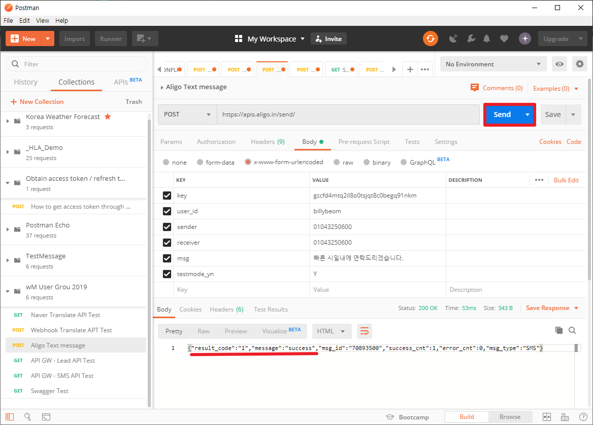
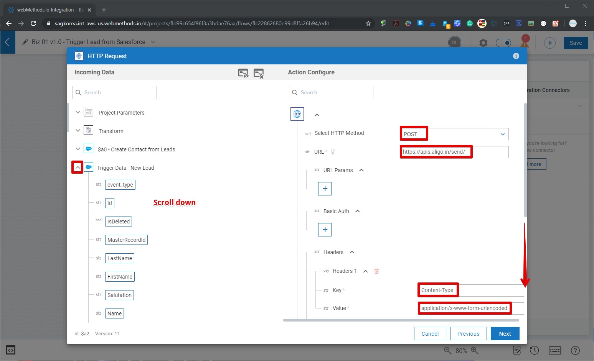
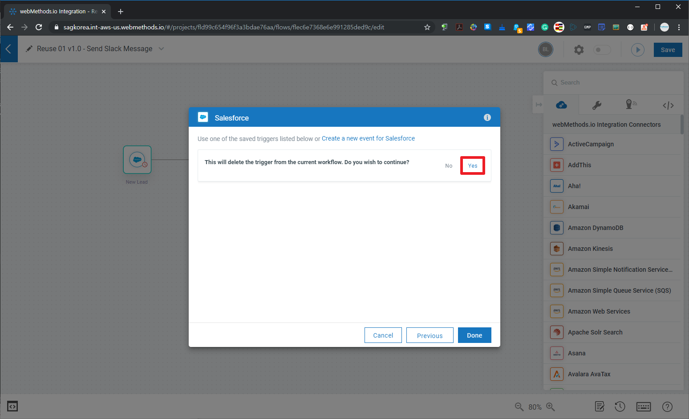

  ## 'webMethods.io Integration과 API 살펴보기' 튜토리얼 - Part 1  
  2019년 12월 webMethods User Group Meetup 행사의 'webMethods.io Integration과 API 살펴보기' Part 1으로 webMethods.io Integration에 대한 튜토리얼입니다.  
  Part 1과 Part 2에 대한 전체적인 개요 설명을 [Dec-2019 유저 그룹 행사 페이지](https://github.com/SoftwareAG-Korea/tutorials/blob/master/UserGroup/Dec-2019/wmio+integration+api/)를 참고하세요.  
  
  Part 1과 Part 2에 대한 전체적인 개요 설명부터 시작하시려면 [Dec-2019 유저 그룹 행사 페이지](https://github.com/SoftwareAG-Korea/tutorials/blob/master/UserGroup/Dec-2019/wmio+integration+api/)를 참고하세요.  
  
  > Author: [Software AG, Korea](https://www.softwareag.com/kr/) [이범](https://github.com/billybeom)  
  > Last Modified: 10-JAN-2020  
  
  
  ### Part 1의 사전 준비 사항    
  * (필수) [webMethods.io Integration - Free Trial 신청](https://github.com/SoftwareAG-Korea/tutorials/blob/master/UserGroup/Dec-2019/wmio+integration+api/Prerequisite/README.preq1.md)  
  * (필수) [Saleforce Developer Free Trial](https://github.com/SoftwareAG-Korea/tutorials/blob/master/UserGroup/Dec-2019/wmio+integration+api/Prerequisite/README.preq2.md)  
  * (필수) [Saleforce에서 ConnectedApp 생성](https://github.com/SoftwareAG-Korea/tutorials/blob/master/UserGroup/Dec-2019/wmio+integration+api/Prerequisite/README.preq3.md)  
  * (옵션) [Postman으로 access token과 refresh token 받기](https://github.com/SoftwareAG-Korea/tutorials/blob/master/UserGroup/Dec-2019/wmio+integration+api/Prerequisite/README.preq4.md)  
  
  ### Part 1. webMethods.io Integration 튜토리얼  
  webMethods.io Integration에서 Salesforce connector을 이용하여 생성되는 Lead로부터 연락처를 입력하고 Slack과 SMS를 보내는 workflow를 만들어 봅니다.  
  
  ### Part 1.1 webMethods.io Integration 로그인 및 프로젝트 생성
  http://softwareag.cloud 에 접속하여 가입 당시 생성한 클라우드 테넌트(Tenant)를 입력하고 Username과 Password를 입력하여 로그인 합니다.  
    
    
    
  
  webMethods.io Integration을 선택하고 Tutorial Project를 생성합니다.   
    
    
    
  
  
  ### Part 1.2 Workflow 생성  
  'New Workflow'를 버튼을 클릭하여 workflow 이름과 tags(추후 tag로 쉽게 workflow 검색할 수 있음)을 입력하여 workflow를 생성합니다.  
    
    
    
  
  
  ### Part 1.3 Biz Workflow - 리드 트리거 설정  
  Salesforce에서 사전 준비 단계에 만든 ConnectedApp에 대한 OAuth2 토큰을 발급 받아서 Salesforce 트리거를 설정합니다.  
  
  Salesforce에서 ConnectedApp을 생성하지 않으셨다면 [Saleforce에서 ConnectedApp 생성](https://github.com/SoftwareAG-Korea/tutorials/blob/master/UserGroup/Dec-2019/wmio+integration+api/Prerequisite/README.preq3.md) 튜토리얼을 참고하여 ConnectedApp을 생성해야 합니다.  

  본 튜토리얼에서는 workflow과 Salesforce의 ConnectedApp의 Owner가 같다라는 전제로 진행됩니다.  
  만약 Salesforce의 ConnectedApp에 대한 담당자가 다르다면 Salesforce의 담당자로부터 OAuth 토근을 전달 받아서 설정해야 합니다.  
  이 부분은 Salesforce의 ConnectedApp에 대한 담당자가 사전 준비 단계의 [Postman으로 access token과 refresh token 받기](https://github.com/SoftwareAG-Korea/tutorials/blob/master/UserGroup/Dec-2019/wmio+integration+api/Prerequisite/README.preq4.md) 튜토리얼 참고하여 OAuth 토큰 정보를 workflow의 Owner에게 안전하게 전달해줘야 합니다.  
  
    
    
  
  아래 단계부터는 Salesforce로부터 OAuth2 토큰 발급 과정입니다.  
    
    
    
    
    
    
  
  Salesforce의 OAuth2 설정이 완료되었으니 이제 Salesforce에서 Lead를 추가하여 webMethods.io Integration에서 Salesforce에 추가된 Lead 정보가 잘 트리거(Trigger)되는지 확인합니다.  
    
    
    
    
    
    
    
    
    
  
  
  ### Part 1.4 Biz Workflow - 연락처 입력  
  이제 Salesforce의 Lead 정보에 대한 트리거(Trigger) 설정이 끝났으니 들어오는 트리거 정보를 처리하는 부분을 설정합니다. 트리거로 들어온 정보를 Salesforce 이외의 다른 CRM SaaS 서비스에 입력할 수도 있습니다.  
  본 튜토리얼에서는 아래와 같이 Salesforce의 Lead 정보에 포함되어 있는 연락처 정보를 Salesforce의 연락처(Contact)에 입력하는 시나리오로 진행합니다.  
  
  Workflow 캔버스에 Salesforce CRM Connector를 드래그 앤 드랍으로 설정합니다.  
    
    
  Salesforce CRM Connector가 수행할 API 서비스 중에 'Create Contact' Action을 선택하고 해당 블럭의 이름(Name)을 'Create Contact from Leads'라고 설정하고 Salesforce에 대한 인증/인가는 Part 1.3 단계에서 설정한 OAuth2 설정을 재사용하여 설정합니다.  
    
  
  Salesforce의 Lead 정보의 이름(FirstName과 LastName) 정보를 Salesforce CRM Connector의 'Create Contact' API에 대한 파라미터를 드래그 앤 드랍으로 설정합니다.  
    
    
  
  테스트를 수행하여 연락처를 입력하는 과정이 정상적으로 수행되는지 확인합니다.
    
    
    
  
  FirstName, LastName과 MobilePhone 정보가 Salesforce의 연락처(Contact)에 잘 등록되었는지 확인합니다.
    
    
    
  
  
  ### Part 1.5 Biz Workflow - Slack 메신저 보내기  
  Slack 대신에 사내 메신저를 할 수도 있습니다. webMethods.io Integration는 Custom(사용자 정의) Connector를 node.js로 만들 수 있는 기능을 제공합니다. 만들어서 사용할 수 있습니다.  
  사내 메신저가 Salesforce/Concur/WorkDay와 같은 SaaS/PaaS처럼 API를 제공한다면 사내 메신저 Connector를 만들어서 사용할 수 있습니다.  
  본 튜토리얼에서는 Slack 메신저 Connector을 이용하여 Salesforce의 Lead 정보를 다수의 Slack 사용자가 초대되어 있는 Lead 채널에 Lead 정보를 보내는 시나리오로 진행합니다.  
  Workflow 캔버스에 Slack Connector를 드래그 앤 드랍으로 설정합니다.  
    
    
  
  Slack Connector가 수행할 API 서비스 중에 'Post Message to Channel' Action을 선택하고 해당 블럭의 이름(Name)을 설정하고 Slack OAuth2 설정합니다.  
  Slack으로부터 OAuth2 토큰 발급 과정은 Part 1.3 단계에서 Salesforce로부터 OAuth2 토큰 발급 과정과 비슷합니다.   
    
  
  OAuth2를 제대로 사용하려면 webMethods.io Integration이 사용할 수 있는 권한만 선택하여 설정(Scope 지정)해야 하지만 튜토리얼 편의상 모든 사용 권한이 선택된 default로 진행하도록 하겠습니다.  
    
    
    
  
  Slack 채널명을 선택하고 보낼 메시지를 드래그 앤 드랍 및 사용자 메시지를 추가하여 아래와 같이 설정합니다.  
    
    
    
    
  
  Slack의 '#salesforce-lead-channel' 채널에 설정한 메시지가 제대로 보내졌는지 Slack 프로그램에서 확인합니다.  
  아래의 좌측은 Billy Beom 사용자의 핸드폰의 Slack 앱에서 확인한 화면이고 아래의 우측은 Software AG, Korea 사용자의 PC용 Slack 어플리케이션에서 확인한 화면입니다.  
    
  
  
  ### Part 1.6 Biz Workflow - SMS 문자 보내기  
  Twilio라는 글로벌 SMS SaaS 서비스를 연동하는 경우에는 Twilio Connector를 이용하여 쉽게 연동할 수 있습니다.  
  본 튜토리얼에서는 국내 SMS 문자 및 카카오 메시지 서비스를 하는 알리고(Aligo) API를 이용하는 것으로 진행하겠습니다. 본 서비스는 구글에서 국내 SMS 서비스로 검색해서 첫번째로 나온 검색 결과를 이용한 것 뿐이고 알리고(Aligo) 서비스를 알리기 위해서 사용한 것이 아니며 외부 HTTP URL 또는 REST기반의 API를 호출하는 시나리오를 보여주기 위함입니다.
  또한, 알리고(Aligo) 서비스는 유료 서비스이기 때문에 test 파라미터를 설정하여 실제 SMS 전송 확인은 하지 않고 알리고(Aligo)에 HTTP 호출이 정상적으로 잘되는지만 확인하도록 하겠습니다.  
  
  알리고(Aligo) API를 호출하기 위해서 Workflow 캔버스에 'HTTP Request' 모듈을 드래그 앤 드랍으로 설정합니다.  
    
    
    
  
  알리고의 문자 API를 호출하는 설정을 아래와 같이 진행합니다.  
    
    
    
    
    
  
  아래의 설정을 해야 하는 이유는 종종 외부 API 서비스들이 IP를 기반으로 정상트래픽인지 관리하기도 합니다.  
  webMethods.io Integration에서 알리고를 호출하는 것이기 떄문에 webMethods.io Integration의 Outgoing IP를 알리고(Aligo) 서비스에 등록합니다.  
  현재 webMethods.io는 현재 AWS의 2개 Region에서 현재 서비스되고 있기 떄문에 2개 Region의 Outgoing IP를 등록한 것입니다. webMethods.io의 Region은 지속적으로 추가되고 있고 외부 서비스 연동을 위해서 본인이 사용 중인 Region의 Outgoing IP를 알아둘 필요가 있습니다.  
    
    
  
  아래와 같이 알리고(Aligo) 문자 API의 HTTP Header을 설정합니다.
    
  
  아래와 같이 알리고(Aligo) 문자 API의 HTTP Body에 receiver, msg, testmode_yn을 설정합니다.  
    
    
    
  
  좌측 하단의 아이콘을 클릭하면 테스트 진행 과정을 보다 자세하게 확인할 수 있습니다.  
    
    
    
  
  
  ### Part 1.7 Reuse 01 Workflow - Slack/SMS 공통 workflow 만들기  
  Slack에 메시지를 보내는 부분과 SMS 메시지를 보내는 부분은 재사용이 많이 될 수 있기 때문에 재사용 가능한 Workflow를 Slack용, SMS용 2개를 만들어 보도록 하겠습니다.  
  
  먼저 재사용 가능한 SMS용 Workflow을 만들기 위해서 Part 1.6에서 만든 Workflow를 복사하고 Trigger 설정을 Webhook으로 변경하고 전송할 메시지를 전달하기 위해서 Webhook Payload를 활성화합니다.  
  복사(Clone)한 Workflow에서 Slack 부분만 남겨놓고 다른 블럭은 모두 삭제하고 Webhook Payload로부터 전달받은 메시지를 이용하여 Slack 메시지를 다시 구성합니다.  
    
    
    
    
    
    
    
    
    
    
    
    
    
    
    
    
    
    
  
  이번에는 재사용 가능한 SMS용 Workflow을 만들기 위해서 Part 1.6에서 만든 Workflow를 복사하고 Trigger 설정을 Webhook으로 변경하고 전송할 메시지를 전달하기 위해서 Webhook Payload를 활성화합니다.  
  복사(Clone)한 Workflow에서 SMS 부분만 남겨놓고 다른 블럭은 모두 삭제하고 Webhook Payload로부터 전달받은 메시지를 이용하여 SMS 메시지를 다시 구성합니다.  
    
    
    
    
    
    
    
    
    
  
  재사용이 가능한 Slack/SMS용 Workflow을 모두 만들어 있으니 이제는 Part 1.6에서 만든 기존 비즈니스용 Workflow에서 Slack/SMS Workflow를 호출하도록 변경해야 합니다.  
  기존 버전을 남겨두고 새로운 버전으로 만들기 위해서 기존 비즈니스용 Workflow을 복사(Clone)하여 v2.0을 만들고 변경 및 테스트가 완료되면 기존 v1.0 Workflow는 비활성화하고 v2.0 Workflow를 활성화할 것입니다.  
    
    
    
    
  
  Slack Connector을 'Run Workflow' 블럭을 교체하고 'Run Workflow'에서 Slack Workflow을 호출하도록 설정합니다.  
    
    
    
    
    
    
    
    

  SMS를 보내는 블럭을 'Run Workflow' 블럭을 교체하고 'Run Workflow'에서 SMS Workflow을 호출하도록 설정합니다. 이 부분은 위의 Slack Connector을 교체한 똑같은 방법으로 직접 해보시기 바랍니다.  
    
  
  비즈니스 v2.0 Workflow가 완성되었으면 v1.0을 비활성화 하고 v2.0을 활성화합니다.  
    
    
    
    
  
  
  ### Part 1.8 (옵션) 네이버 파파고 번역 서비스 연동하기  
  보너스 튜토리얼 부분으로 API로 연동하는 추가 예제를 더 해보고 싶은 분들은 직접 해보시기 바랍니다.  
  본 튜토리얼에서는 Slack 메시지를 보내는 Workflow에 파파고 번역 서비스를 API로 연동하도록 해보겠습니다.  
    
    
    
  
  보너스 튜토리얼 부분으로 Workflow 성능 개선 부분입니다. Workflow의 각 블럭들이 순차적으로 호출되어야 하는지 병렬로 호출할 수 있는지를 확인하여 최대한 병렬로 호출하면 Workflow의 성능을 개선할 수 있습니다.   
    
    
  
  
  ### Part 1.9 (옵션) 공통 workflow 대신에 API 서비스로 변경
  Part 2에서는 재사용이 가능하도록 만든 공통 Slack/SMS workflow을 인가된 사용자에게만 안전하게 API를 제공하는 webMethods.io API 서비스에 대한 튜토리얼이 진행됩니다.  
  보다 많은 튜토리얼을 경험하고 싶은 분들은 Part 2의 튜토리얼을 끝까지 수행하고 Biz Workflow에서 공통 Slack/SMS workflow를 'Run Workflow' 블럭 대신에 'HTTP Request' 블럭으로 교체하고 webMethods.io API Portal에서 할당받은  API Key를 이용하여 안전하게 API 연동 방식으로 변경해 볼 수도 있습니다. 관심있으신 분들은 알리고(Aligo) 문자 API 서비스를 연계하는 파트를 참고하여 스스로 진행해 보시기 바랍니다.  
  
  
