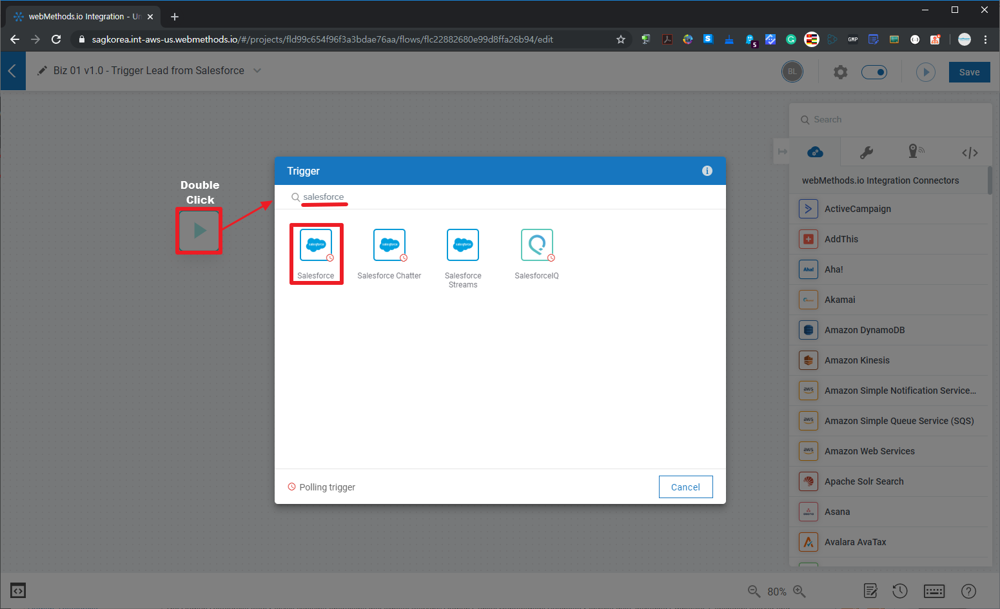
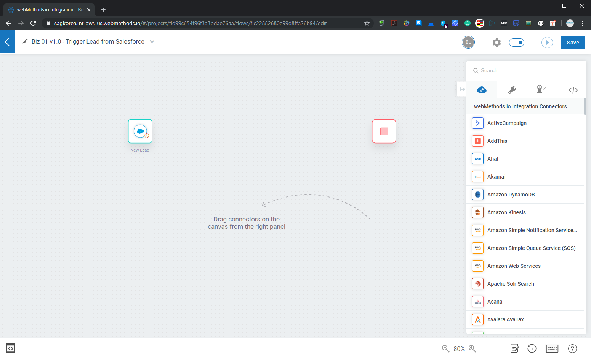
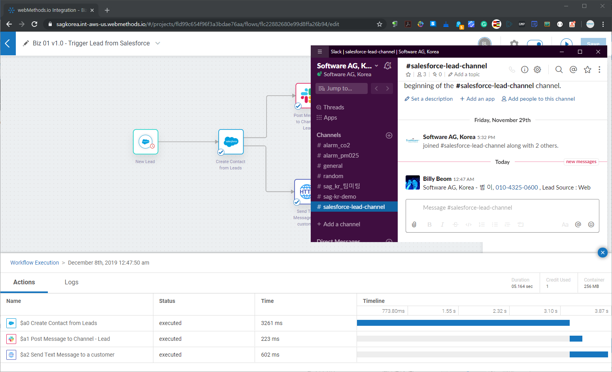
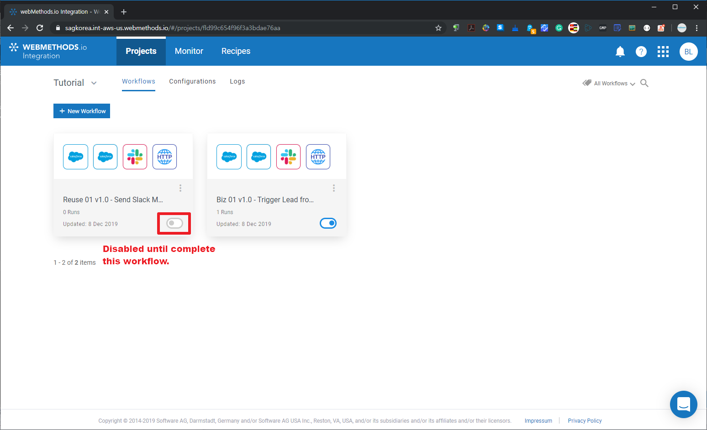
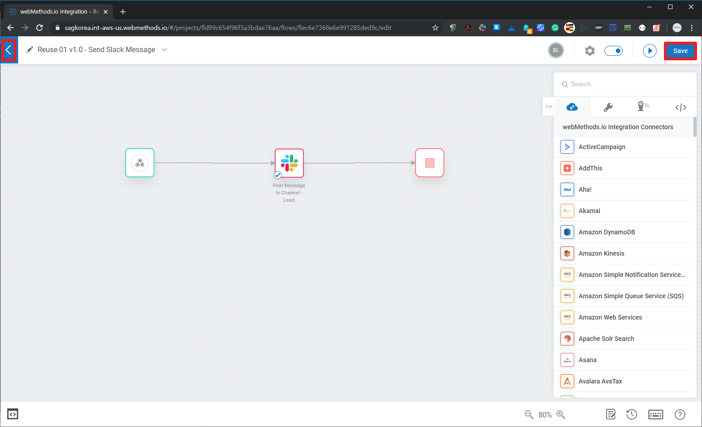
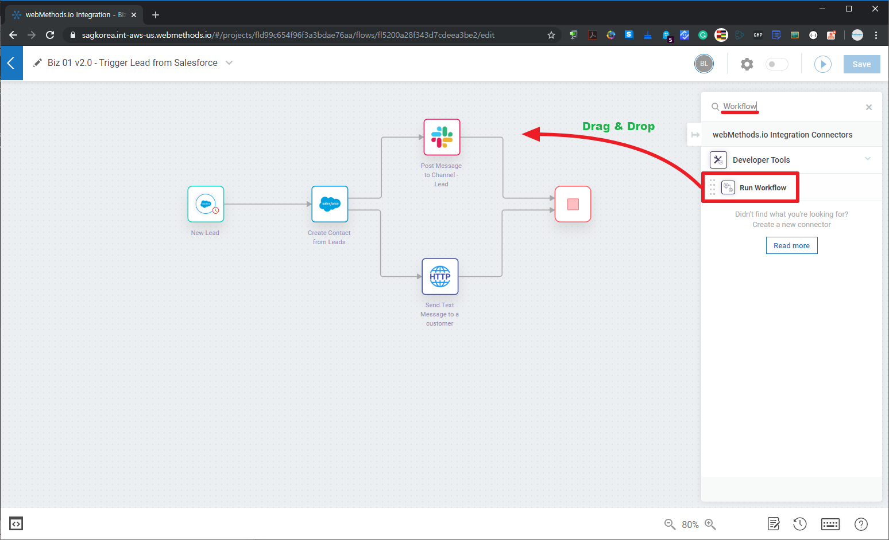
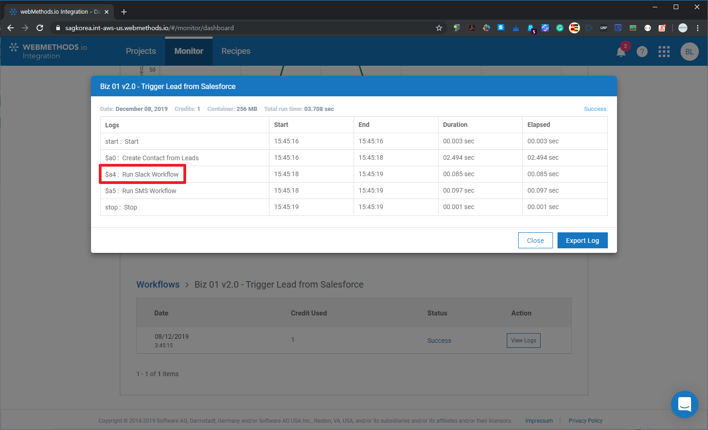

  ## 'webMethods.io Integration과 API 살펴보기' 튜토리얼 - Part 1  
  2019년 12월 webMethods User Group Meetup 행사의 'webMethods.io Integration과 API 살펴보기' Part 1으로 webMethods.io Integration에 대한 튜토리얼입니다.  
  Part 1과 Part 2에 대한 전체적인 개요 설명을 [Dec-2019 유저 그룹 행사 페이지](https://github.com/SoftwareAG-Korea/tutorials/tree/master/UserGroup/Dec-2019/wmio+integration+api/)를 참고하세요.  
  
  Part 1과 Part 2에 대한 전체적인 개요 설명부터 시작하시려면 [Dec-2019 유저 그룹 행사 페이지](https://github.com/SoftwareAG-Korea/tutorials/tree/master/UserGroup/Dec-2019/wmio+integration+api/)를 참고하세요.  
  
  > Author: Software AG Korea [이범](https://github.com/billybeom)  
  > Last Modified: 10-JAN-2020  
  > Last Modified: 10-JAN-2020  
  
  
  ### Part 1의 사전 준비 사항    
  * (필수) [webMethods.io Integration - Free Trial 신청](https://github.com/SoftwareAG-Korea/tutorials/blob/master/UserGroup/Dec-2019/Prerequisite/README.preq1.md)  
  * (필수) [Saleforce Developer Free Trial](https://github.com/SoftwareAG-Korea/tutorials/blob/master/UserGroup/Dec-2019/Prerequisite/README.preq2.md)  
  * (필수) [Saleforce에서 ConnectedApp 생성](https://github.com/SoftwareAG-Korea/tutorials/blob/master/UserGroup/Dec-2019/Prerequisite/README.preq3.md)  
  * (옵션) [Postman으로 access token과 refresh token 받기](https://github.com/SoftwareAG-Korea/tutorials/blob/master/UserGroup/Dec-2019/Prerequisite/README.preq4.md)  
  
  ### Part 1. webMethods.io Integration 튜토리얼  
  webMethods.io Integration에서 Salesforce connector을 이용하여 생성되는 Lead로부터 연락처를 입력하고 Slack과 SMS를 보내는 workflow를 만들어 봅니다.  
  
  ### Part 1.1 webMethods.io Integration 로그인 및 프로젝트 생성
  
  
  
  
  
  
  
  
  ### Part 1.2 Workflow 생성  
  
  
  
  
  
  ### Part 1.3 Biz Workflow - 리드 트리거 설정  
  Salesforce에서 사전에 만든 ConnectedApp의 OAuth을 받아서 Salesforce 트리거를 설정합니다.
  
  
  
  
  
  
  
  
  
  
  
  
  
  
  
  
  
  
  
  ### Part 1.4 Biz Workflow - 연락처 입력  
  Salesforce 이외의 다른 CRM SaaS 서비스에 입력할 수도 있습니다. 본 튜토리얼에서는 Lead에 들어온 연락처 정보를 Salesforce의 연락처에 입력하는 시나리오로 진행합니다.
  
  
  
  
  
  
  
  
  
  
  
  
  
  ### Part 1.5 Biz Workflow - Slack 메신저 보내기  
  사내 메신저가 SaaS/PaaS처럼 API를 제공한다면 node.js로 Custom(사용자 정의) Connector를 만들어서 사용할 수 있습니다. 본 튜토리얼에서는 Slack 메신저로 Salesforce의 Lead 정보를 에 다수의 Slack 사용자가 초대되어 있는 Lead 채널에 Lead 정보를 보내는 시나리오로 진행합니다.  
  
  
  
  
  
  
  
  
  
  
  
  
  
  ### Part 1.6 Biz Workflow - SMS 문자 보내기  
  Twilio라는 글로벌 SMS SaaS 서비스를 연동하는 경우에는 Twilio Connector를 제공하기 때문에 보다 쉽게 연동할 수 있습니다. 본 튜토리얼에서는 국내 SMS 문자 및 카카오 메시지 서비스를 하는 알리고(Aligo) API를 이용하여 연동하기로 합니다. 알리고(Aligo) 서비스는 유료 서비스이기 때문에 test 파라미터를 설정하여 호출이 잘되는지만 확인하도록 하겠습니다.  
  
  
  
  
  
  
  
  
  
  
  
  
  
  
  
  
  
  
  
  ### Part 1.7 Reuse 01 Workflow - Slack/SMS 공통 workflow 만들기  
  
  
  
  
  
  
  
  
  
  
  
  
  
  
  
  
  
  
  
  
  
  
  
  
  
  
  
  
  
  
  
  
  
  
  
  
  
  
  
  
  
  
  
  
  
  
  ### Part 1.8 (옵션) 네이버 파파고 번역 서비스 연동하기  
  SMS 문자 보내는 workflow로 연결해야 해야 하지만 알리고(Aligo) 서비스는 유료 서비스이기 떄문에 Slack 메시지를 보내는 Workflow에 파파고 번역 서비스를 API로 연동하는 시나리오로 진행합니다.  
  
  
  
  
  
 
  
  
  ### Part 1.9 (옵션) 공통 workflow 대신에 API 서비스로 변경
  Biz workflow에서 공통 Slack/SMS workflow 호출하는 부분을 Part 2에서 만든 API로 안전하게 연동해보세요.
  
  
