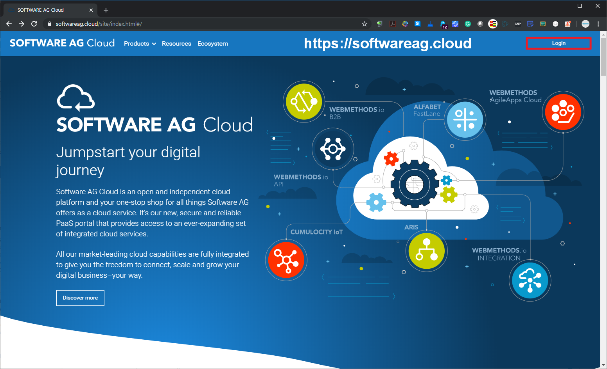
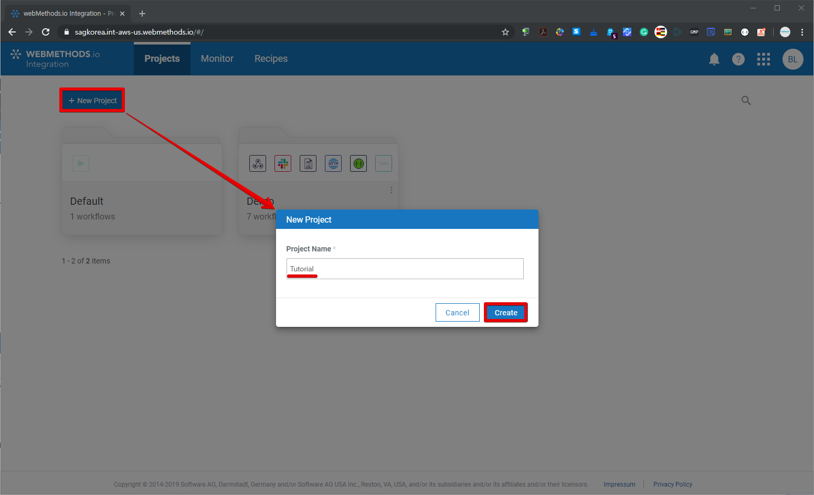
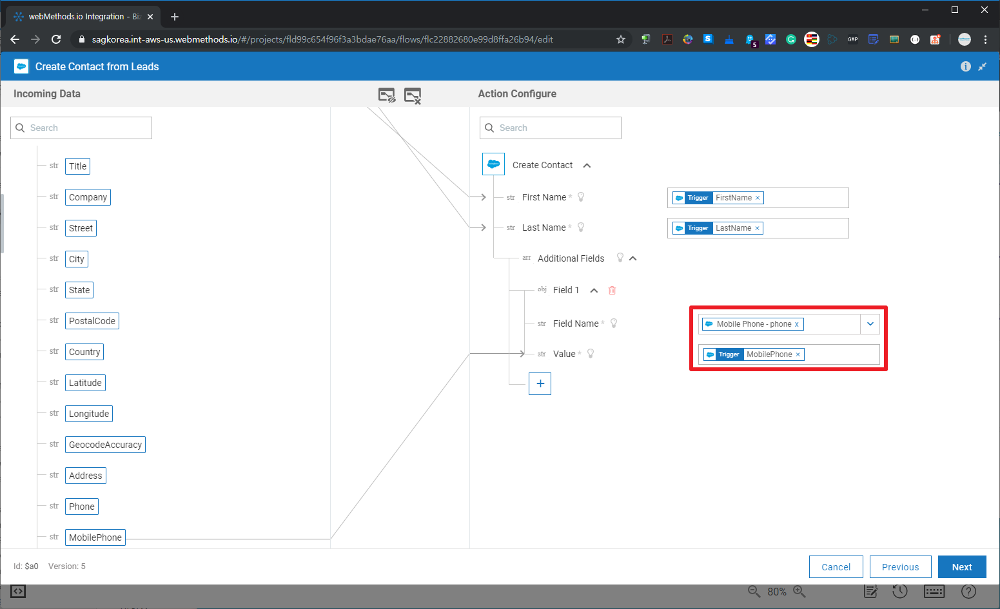
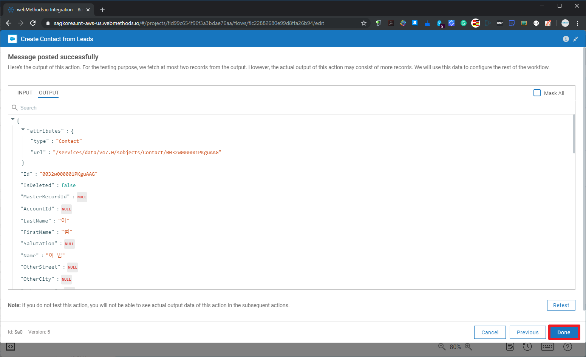
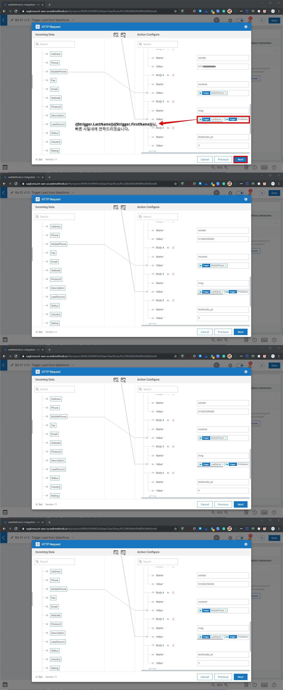
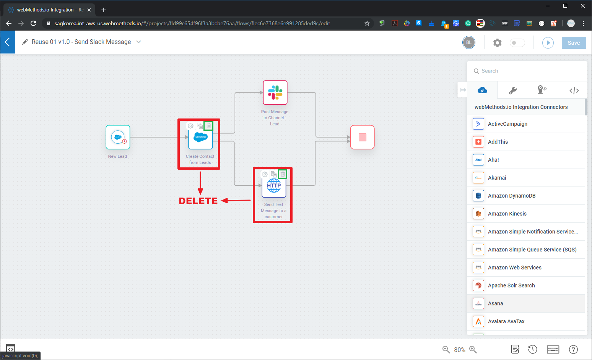
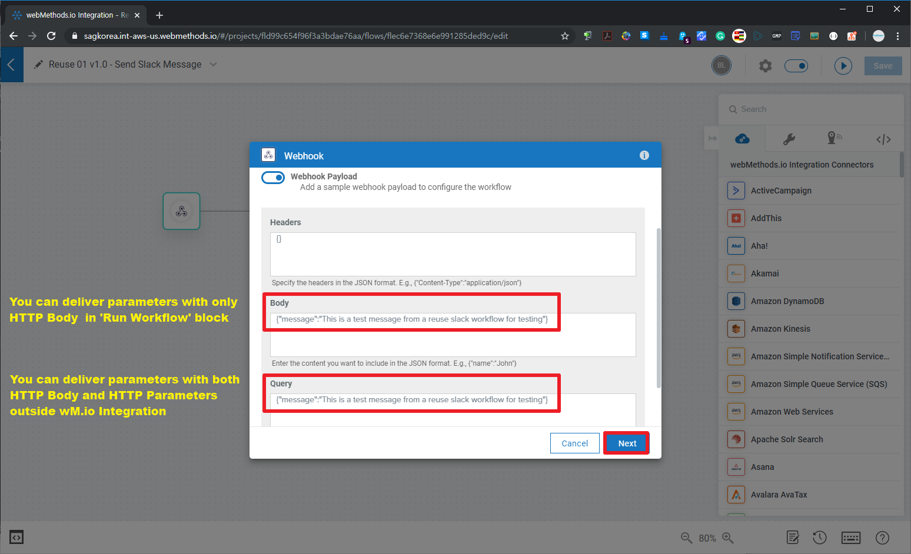
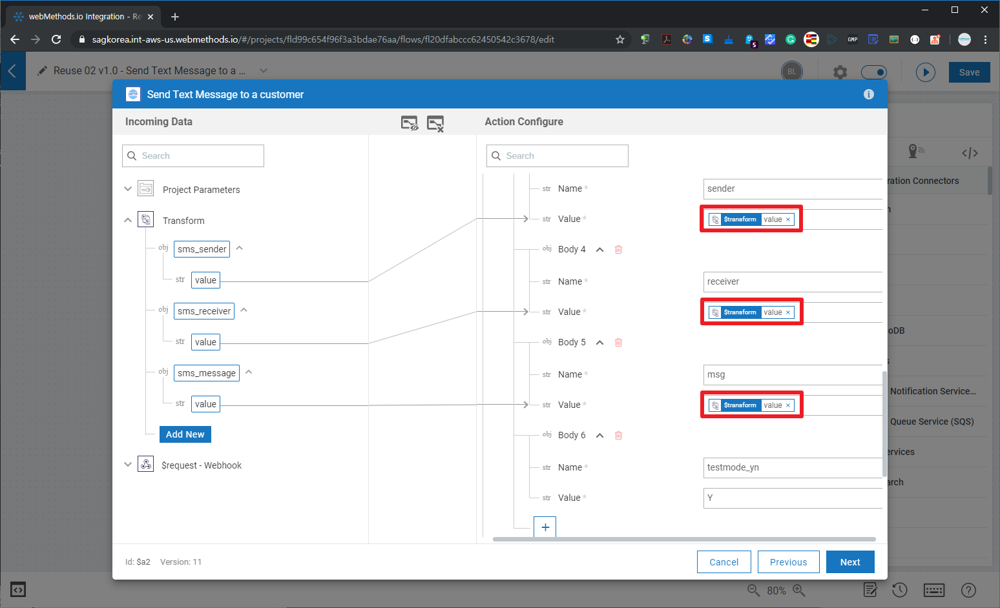
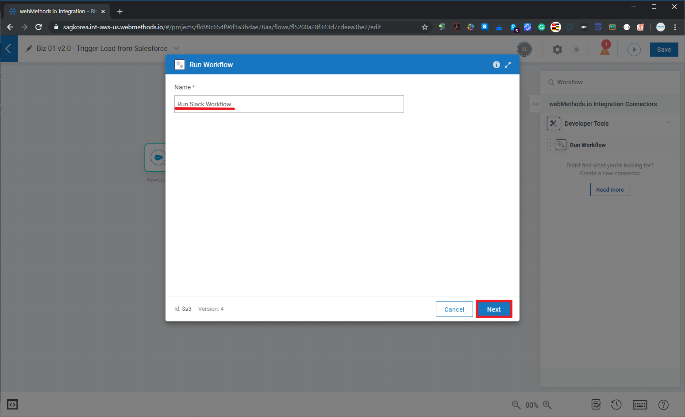

  ## 'webMethods.io Integration과 API 살펴보기' 튜토리얼 - Part 1  
  2019년 12월 webMethods User Group Meetup 행사의 'webMethods.io Integration과 API 살펴보기' Part 1으로 webMethods.io Integration에 대한 튜토리얼입니다.  
  Part 1과 Part 2에 대한 전체적인 개요 설명을 [Dec-2019 유저 그룹 행사 페이지](https://github.com/SoftwareAG-Korea/tutorials/blob/master/UserGroup/Dec-2019/wmio+integration+api/)를 참고하세요.  
  
  Part 1과 Part 2에 대한 전체적인 개요 설명부터 시작하시려면 [Dec-2019 유저 그룹 행사 페이지](https://github.com/SoftwareAG-Korea/tutorials/blob/master/UserGroup/Dec-2019/wmio+integration+api/)를 참고하세요.  
  
  > Author: [Software AG, Korea](https://www.softwareag.com/kr/) [이범](https://github.com/billybeom)  
  > Last Modified: 10-JAN-2020  
  
  
  ### Part 1의 사전 준비 사항    
  * (필수) [webMethods.io Integration - Free Trial 신청](https://github.com/SoftwareAG-Korea/tutorials/blob/master/UserGroup/Dec-2019/wmio+integration+api/Prerequisite/README.preq1.md)  
  * (필수) [Saleforce Developer Free Trial](https://github.com/SoftwareAG-Korea/tutorials/blob/master/UserGroup/Dec-2019/wmio+integration+api/Prerequisite/README.preq2.md)  
  * (필수) [Saleforce에서 ConnectedApp 생성](https://github.com/SoftwareAG-Korea/tutorials/blob/master/UserGroup/Dec-2019/wmio+integration+api/Prerequisite/README.preq3.md)  
  * (옵션) [Postman으로 access token과 refresh token 받기](https://github.com/SoftwareAG-Korea/tutorials/blob/master/UserGroup/Dec-2019/wmio+integration+api/Prerequisite/README.preq4.md)  
  
  ### Part 1. webMethods.io Integration 튜토리얼  
  webMethods.io Integration에서 Salesforce connector을 이용하여 생성되는 Lead로부터 연락처를 입력하고 Slack과 SMS를 보내는 workflow를 만들어 봅니다.  
  
  ### Part 1.1 webMethods.io Integration 로그인 및 프로젝트 생성
  http://softwareag.cloud 에 접속하여 가입 당시 생성한 클라우드 테넌트(Tenant)를 입력하고 Username과 Password를 입력하여 로그인 합니다.  
    
    
    
  
  webMethods.io Integration을 선택하고 Tutorial Project를 생성합니다.   
    
    
    
  
  
  ### Part 1.2 Workflow 생성  
  'New Workflow'를 버튼을 클릭하여 workflow 이름과 tags(추후 tag로 쉽게 workflow 검색할 수 있음)을 입력하여 workflow를 생성합니다.  
    
    
    
  
  
  ### Part 1.3 Biz Workflow - 리드 트리거 설정  
  Salesforce에서 사전 준비 단계에 만든 ConnectedApp에 대한 OAuth2 토큰을 발급 받아서 Salesforce 트리거를 설정합니다. 
  
  Salesforce에서 ConnectedApp을 생성하지 않으셨다면 [Saleforce에서 ConnectedApp 생성](https://github.com/SoftwareAG-Korea/tutorials/blob/master/UserGroup/Dec-2019/wmio+integration+api/Prerequisite/README.preq3.md) 튜토리얼을 참고하여 ConnectedApp을 생성해야 합니다.  

  본 튜토리얼에서는 workflow과 Salesforce의 ConnectedApp의 Owner가 같다라는 전제로 진행됩니다.  
  만약 Salesforce의 ConnectedApp에 대한 담당자가 다르다면 Salesforce의 담당자로부터 OAuth 토근을 전달 받아서 설정해야 합니다.  
  이 부분은 사전 준비 단계의 [Postman으로 access token과 refresh token 받기](https://github.com/SoftwareAG-Korea/tutorials/blob/master/UserGroup/Dec-2019/wmio+integration+api/Prerequisite/README.preq4.md) 튜토리얼을 참고하시기 바랍니다.  
  
    
    
  
  아래 단계부터는 Salesforce로부터 OAuth2 토큰 발급 과정입니다.  
    
    
    
    
    
    
  
  Salesforce의 OAuth2 설정이 완료되었으니 이제 Salesforce에서 Lead를 추가하여 webMethods.io Integration에서 Salesforce에 추가된 Lead 정보가 트리거(Trigger)가 잘 작동하는지 테스트 합니다.  
    
    
    
    
    
    
    
    
    
  
  
  ### Part 1.4 Biz Workflow - 연락처 입력  
  이제 Salesforce의 Lead 정보에 대한 트리거(Trigger) 설정이 끝났으니 들어오는 트리거 정보를 처리하는 부분을 설정합니다. Salesforce 이외의 다른 CRM SaaS 서비스에 트리거로 들어온 정보를 입력할 수도 있습니다.  
  본 튜토리얼에서는 아래와 같이 Salesforce의 Lead 정보의 연락처 정보를 Salesforce의 연락처에 입력하는 시나리오로 진행합니다.  
    
    
  Salesforce CRM Connector가 수행할 API 중에 'Create Contact' Action을 선택하고 해당 단계에 대한 Name을 'Create Contact from Leads'라고 설정하고 Salesforce에 대한 인증은 Part 1.3 단계에서 설정한 OAuth2 설정을 재사용하여 설정합니다.  
    
  
  Salesforce의 Lead 정보의 이름(FirstName과 LastName) 정보를 Salesforce CRM Connector의 'Create Contact' API에 대한 파라미터를 드래그 앤 드랍으로 설정합니다.  
    
    
    
    
    
  테스트를 수행한 결과가 정상적으로 수행되었는지 확인하기 위해서 Salesforce에 접속하여 연락처(Contact)를 확인합니다.  
    
    
    
  
  
  ### Part 1.5 Biz Workflow - Slack 메신저 보내기  
  만약 사내 메신저가 SaaS/PaaS처럼 API를 제공한다면 node.js로 Custom(사용자 정의) Connector를 만들어서 사용할 수 있습니다.  
  본 튜토리얼에서는 Slack 메신저로 Salesforce의 Lead 정보를 다수의 Slack 사용자가 초대되어 있는 Lead 채널에 Lead 정보를 보내는 시나리오로 진행합니다.  
  Workflow 캔버스에 Slack Connector를 드래그 앤 드랍으로 설정합니다.  
    
    
  아래 단계부터는 Slack으로부터 OAuth2 토큰 발급 과정입니다. Part 1.3 단계에서 Salesforce로부터 OAuth2 토큰 발급 과정과 유사합니다.   
    
  OAuth2를 제대로 사용하려면 webMethods.io Integration이 사용할 수 있는 권한만 설정(Scope 지정)해야 하지만 편의상 모든 사용 권한이 선택된 default로 진행하도록 하겠습니다.  
    
    
    
    
    
    
    
    
  
  
  ### Part 1.6 Biz Workflow - SMS 문자 보내기  
  Twilio라는 글로벌 SMS SaaS 서비스를 연동하는 경우에는 Twilio Connector를 제공하기 때문에 보다 쉽게 연동할 수 있습니다. 본 튜토리얼에서는 국내 SMS 문자 및 카카오 메시지 서비스를 하는 알리고(Aligo) API를 이용하여 연동하기로 합니다. 알리고(Aligo) 서비스는 유료 서비스이기 때문에 test 파라미터를 설정하여 호출이 잘되는지만 확인하도록 하겠습니다.  
  
  
  
  
  
  
  
  
  
  
  
  
  
  
  
  
  
  
  
  ### Part 1.7 Reuse 01 Workflow - Slack/SMS 공통 workflow 만들기  
  
  
  
  
  
  
  
  
  
  
  
  
  
  
  
  
  
  
  
  
  
  
  
  
  
  
  
  
  
  
  
  
  
  
  
  
  
  
  
  
  
  
  
  
  
  
  ### Part 1.8 (옵션) 네이버 파파고 번역 서비스 연동하기  
  SMS 문자 보내는 workflow로 연결해야 해야 하지만 알리고(Aligo) 서비스는 유료 서비스이기 떄문에 Slack 메시지를 보내는 Workflow에 파파고 번역 서비스를 API로 연동하는 시나리오로 진행합니다.  
  
  
  
  
  
 
  
  
  ### Part 1.9 (옵션) 공통 workflow 대신에 API 서비스로 변경
  Biz workflow에서 공통 Slack/SMS workflow 호출하는 부분을 Part 2에서 만든 API로 안전하게 연동해보세요.
  
  
